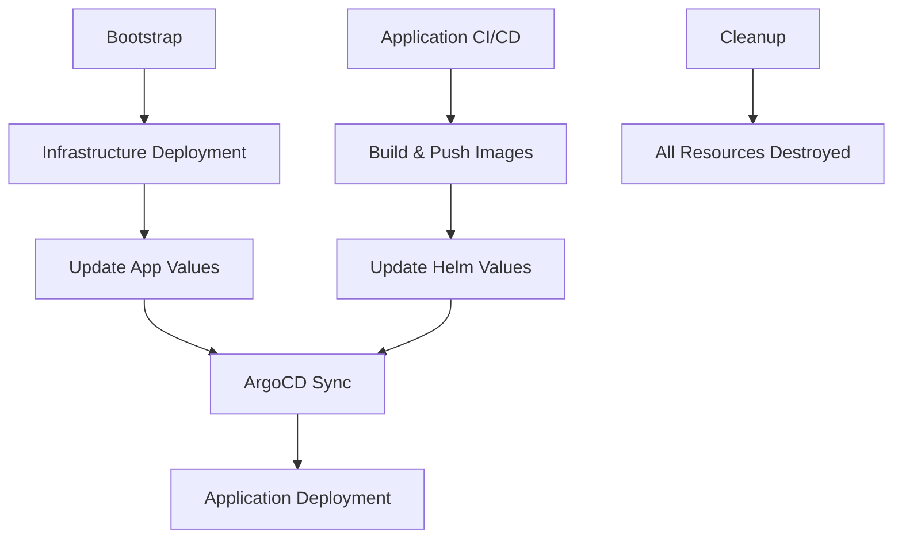

# GitHub Actions Workflows Documentation

This directory contains all GitHub Actions workflows for the TByte microservices platform. Each workflow serves a specific purpose in the CI/CD pipeline and infrastructure management.

## Workflow Overview

| Workflow | Purpose | Trigger | Duration |
|----------|---------|---------|----------|
| [Infrastructure Deployment](#infrastructure-deployment) | Deploy AWS infrastructure | Push to main, Manual | ~20-30 min |
| [Application CI/CD](#application-cicd) | Build, test, and deploy apps | Push to main/develop | ~10-15 min |
| [Update App Values](#update-app-values) | Sync Terraform outputs to Helm | Called by other workflows | ~2-3 min |
| [Bootstrap Infrastructure](#bootstrap-infrastructure) | Initial account setup | Manual only | ~5-10 min |
| [Cleanup Infrastructure](#cleanup-infrastructure) | Destroy all resources | Manual only | ~15-20 min |

---

## Detailed Workflow Documentation

### Infrastructure Deployment
**File:** `terragrunt.yml`

**Purpose:** Deploys and manages AWS infrastructure using Terragrunt/Terraform

**Triggers:**
- Push to `main` branch (paths: `terragrunt/**`, `.github/workflows/terragrunt.yml`)
- Pull request to `main` branch (same paths)
- Manual dispatch (`workflow_dispatch`)

**What it does:**
1. **Format Check** - Validates Terraform code formatting
2. **Terraform Validate** - Validates Terraform syntax and configuration
3. **Security Scan** - Runs Checkov security analysis on infrastructure code
4. **Plan** - Creates Terraform execution plan for review
5. **Deploy** - Applies infrastructure changes in order:
   - VPC (networking foundation)
   - IAM (roles and permissions)
   - EKS (Kubernetes cluster)
   - RDS (PostgreSQL database)
   - ArgoCD (GitOps deployment)
6. **Update Apps** - Calls `update-app-values.yml` to sync outputs

**Environment:** Development (`dev`)
**AWS Role:** `${{ secrets.AWS_ROLE_ARN_DEV }}`
**Concurrency:** Single deployment at a time (no cancellation)

---

### Application CI/CD
**File:** `app-cicd.yml`

**Purpose:** Complete CI/CD pipeline for frontend and backend applications

**Triggers:**
- Push to `main` or `develop` branches (paths: `src/**`, `apps/**`, `.github/workflows/app-cicd.yml`)
- Pull request to `main` branch (same paths)

**What it does:**
1. **Quality Gates:**
   - Detects source code changes
   - Runs Node.js tests and linting
   - Performs security scanning (npm audit, Snyk)
   - Validates Dockerfile and Kubernetes manifests

2. **Build & Push:**
   - Builds Docker images for frontend and backend
   - Scans images for vulnerabilities (Trivy)
   - Signs images with Cosign for supply chain security
   - Pushes to ECR with git commit SHA tags

3. **Deploy:**
   - Updates Helm chart values with new image tags
   - Commits changes to trigger ArgoCD sync
   - ArgoCD performs canary deployment via Argo Rollouts

**Container Registry:** ECR in development account
**Image Tagging:** Git commit SHA (e.g., `332ce290`)
**Deployment Strategy:** GitOps via ArgoCD + Argo Rollouts

---

### Update App Values
**File:** `update-app-values.yml`

**Purpose:** Synchronizes Terraform outputs with Kubernetes application configurations

**Triggers:**
- Called by other workflows (`workflow_call`)
- Manual dispatch (`workflow_dispatch`)

**What it does:**
1. **Extract Outputs** from Terragrunt:
   - EKS cluster details (name, endpoint)
   - IAM role ARNs for service accounts
   - Karpenter configuration (node roles, SQS queues)
   - Grafana CloudWatch role

2. **Update Helm Values:**
   - `apps/karpenter/values.yaml` - Auto-scaling configuration
   - `apps/kube-prometheus-stack/values.yaml` - Grafana IRSA
   - `apps/external-secrets/values.yaml` - External Secrets Operator IRSA
   - `apps/karpenter/templates/ec2nodeclass.yaml` - Node provisioning

3. **Commit Changes** with `[skip ci]` to prevent infinite loops

**Authentication:** OIDC with development AWS account
**Git Config:** Uses `github-actions[bot]` for commits

---

### Bootstrap Infrastructure
**File:** `bootstrap.yml`

**Purpose:** Initial setup for new AWS accounts and GitHub OIDC integration

**Triggers:**
- Manual dispatch only (`workflow_dispatch`)
- Requires confirmation input: `"bootstrap"`

**What it does:**
1. Sets up GitHub OIDC provider in AWS
2. Creates initial IAM roles for GitHub Actions
3. Configures S3 bucket for Terraform state
4. Establishes cross-account trust relationships

**Security:** Requires manual confirmation to prevent accidental execution
**Usage:** Run once per AWS account setup
**Prerequisites:** AWS credentials with administrative access

---

### Cleanup Infrastructure
**File:** `cleanup.yml`

**Purpose:** Complete teardown of all AWS resources to avoid ongoing costs

**Triggers:**
- Manual dispatch only (`workflow_dispatch`)
- Requires confirmation input: `"destroy"`

**What it does:**
1. **Ordered Destruction** (reverse of deployment):
   - ArgoCD (GitOps applications)
   - IAM (roles and policies)
   - RDS (database with final snapshot)
   - EKS (cluster and node groups)
   - VPC (networking components)

2. **Error Handling:** Uses `|| true` to continue on errors
3. **Safety:** Requires manual confirmation to prevent accidental deletion

**Warning:** This destroys ALL infrastructure and data
**Recovery:** Requires full redeployment via infrastructure workflow

---

## Security & Authentication

### GitHub OIDC Integration
All workflows use OpenID Connect (OIDC) for secure, keyless authentication to AWS:

```yaml
permissions:
  id-token: write  # Required for OIDC token
  contents: write  # Required for git operations
```

### AWS Roles
- **Development:** `${{ secrets.AWS_ROLE_ARN_DEV }}`
- **Staging:** `${{ secrets.AWS_ROLE_ARN_STAGING }}`
- **Production:** `${{ secrets.AWS_ROLE_ARN_PRODUCTION }}`

### Security Scanning
- **Infrastructure:** Checkov for Terraform security analysis
- **Applications:** Trivy for container vulnerability scanning
- **Dependencies:** npm audit and Snyk for package vulnerabilities
- **Supply Chain:** Cosign for image signing and verification

---

## Workflow Dependencies



---

## Troubleshooting

### Common Issues

1. **Infrastructure Deployment Fails**
   - Check AWS permissions and quotas
   - Verify Terraform state isn't corrupted
   - Review Checkov security scan results

2. **Application Build Fails**
   - Check Node.js version compatibility
   - Review test failures and linting errors
   - Verify Docker build context

3. **ArgoCD Sync Issues**
   - Check Kubernetes cluster connectivity
   - Verify Helm chart syntax
   - Review ArgoCD application logs

### Monitoring Workflows
- **GitHub Actions UI:** Monitor real-time execution
- **AWS CloudTrail:** Track infrastructure changes
- **ArgoCD UI:** Monitor application deployments
- **Grafana Dashboards:** Application and infrastructure metrics

---

## Additional Resources

- [Terragrunt Documentation](../terragrunt/README.md)
- [Application Helm Charts](../apps/README.md)
- [ArgoCD Applications](../argocd-apps/README.md)
- [Technical Documentation](../docs/technical-documentation.md)

---

**Last Updated:** December 15, 2025
**Maintained By:** DevOps Team
