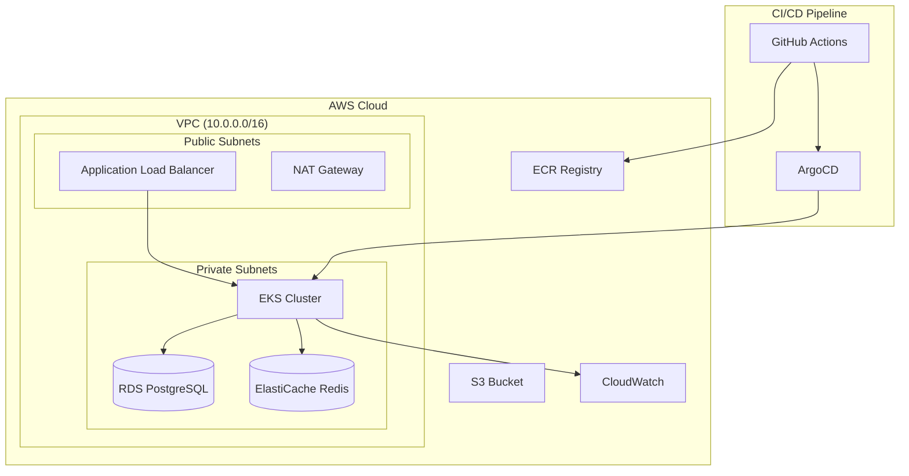

# TByte - Production-Ready Microservices Platform

> **Senior DevOps Engineer Assessment - Complete Implementation**

A comprehensive DevOps solution demonstrating production-ready microservices deployment on AWS EKS with GitOps, observability, and zero-downtime deployments.

## 📋 Deliverables

| Deliverable | Status | Link |
|-------------|--------|------|
| 📄 **Technical Documentation** | ✅ Complete | [Technical Docs](./docs/technical-documentation.md) |
| 🎯 **Presentation Deck** | ✅ Complete | [Presentation](./docs/presentation.pdf) |
| 💻 **Source Code** | ✅ Complete | [GitHub Repository](https://github.com/chiju/tbyte) |

## 🏗️ Architecture Overview



## 🚀 Quick Start

### Prerequisites
- AWS CLI configured with appropriate permissions
- kubectl installed
- Terragrunt installed
- Docker installed

### 1. Infrastructure Deployment
```bash
# Clone repository
git clone https://github.com/chiju/tbyte.git
cd tbyte

# Deploy infrastructure
cd terragrunt/environments/dev
terragrunt run-all apply

# Configure kubectl
aws eks update-kubeconfig --region eu-central-1 --name tbyte-dev
```

### 2. Application Deployment
```bash
# Deploy ArgoCD
kubectl apply -k argocd-apps/

# Deploy applications
kubectl apply -f argocd-apps/tbyte-microservices.yaml
kubectl apply -f argocd-apps/opentelemetry.yaml
```

### 3. Access Applications
```bash
# Get ArgoCD admin password
kubectl -n argocd get secret argocd-initial-admin-secret -o jsonpath="{.data.password}" | base64 -d

# Port forward ArgoCD UI
kubectl port-forward svc/argocd-server -n argocd 8080:443

# Access: https://localhost:8080
```

## 📚 Documentation Structure

### Section A - Kubernetes Implementation
- [A1: Microservices Deployment](./docs/kubernetes/microservices-deployment.md)
- [A2: Troubleshooting Guide](./docs/kubernetes/troubleshooting-guide.md)

### Section B - AWS Cloud Engineering
- [B1: High Availability Architecture](./docs/aws/ha-architecture.md)
- [B2: Infrastructure Troubleshooting](./docs/aws/infrastructure-troubleshooting.md)
- [B3: CI/CD Pipeline](./docs/aws/cicd-pipeline.md)

### Section C - Infrastructure as Code
- [C1: Terraform Modules](./docs/terraform/terraform-modules.md)
- [C2: Terraform Troubleshooting](./docs/terraform/terraform-troubleshooting.md)

### Section D - Observability & Monitoring
- [D1: Monitoring Strategy](./docs/observability/monitoring-strategy.md)
- [D2: Performance Troubleshooting](./docs/observability/performance-troubleshooting.md)

### Section E - System Design
- [E1: Zero-Downtime Deployment](./docs/system-design/zero-downtime-deployment.md)
- [E2: Security Implementation](./docs/system-design/security-implementation.md)

## 🛠️ Technology Stack

| Component | Technology | Purpose |
|-----------|------------|---------|
| **Container Orchestration** | AWS EKS | Managed Kubernetes service |
| **Infrastructure as Code** | Terragrunt + Terraform | Infrastructure provisioning |
| **GitOps** | ArgoCD | Continuous deployment |
| **Service Mesh** | Istio | Traffic management & security |
| **Monitoring** | Prometheus + Grafana | Metrics and dashboards |
| **Tracing** | Jaeger + OpenTelemetry | Distributed tracing |
| **Logging** | CloudWatch + Fluent Bit | Centralized logging |
| **Deployment Strategy** | Argo Rollouts | Canary deployments |
| **CI/CD** | GitHub Actions | Build and test automation |

## 🔧 Key Features Implemented

### ✅ Production-Ready Kubernetes
- Multi-tier microservices (Frontend, Backend, Database)
- Helm charts with comprehensive configurations
- Resource limits, health checks, HPA, PDB
- Network policies and security contexts
- Secrets management and ConfigMaps

### ✅ AWS High Availability
- Multi-AZ EKS cluster with managed node groups
- RDS with Multi-AZ deployment
- ElastiCache for session management
- Application Load Balancer with health checks
- VPC with public/private subnet architecture

### ✅ Zero-Downtime Deployments
- Argo Rollouts with canary strategy
- Automated analysis with Prometheus metrics
- Traffic splitting with Istio
- Rollback capabilities on failure

### ✅ Comprehensive Observability
- OpenTelemetry for distributed tracing
- Prometheus metrics collection
- Grafana dashboards
- CloudWatch integration
- Custom SLI/SLO monitoring

### ✅ Security Best Practices
- IAM roles with least privilege
- Kubernetes RBAC
- Network policies
- Pod security standards
- Secrets encryption at rest

## 📊 Monitoring & Alerting

### Key Metrics Monitored
- **Application**: Response time, error rate, throughput
- **Infrastructure**: CPU, memory, disk, network
- **Business**: User sessions, transaction success rate

### Alerting Strategy
- **SEV1**: Service down, data loss risk
- **SEV2**: Performance degradation, partial outage
- **SEV3**: Warning thresholds, capacity planning

## 🔒 Security Implementation

### Multi-Layer Security
1. **Network**: VPC, Security Groups, NACLs
2. **Kubernetes**: RBAC, Network Policies, Pod Security
3. **Application**: TLS, Authentication, Authorization
4. **Data**: Encryption at rest and in transit

## 📈 Performance & Scalability

### Auto-scaling Configuration
- **HPA**: CPU/Memory based pod scaling
- **VPA**: Vertical pod autoscaling
- **Cluster Autoscaler**: Node-level scaling
- **Database**: RDS read replicas

## 🚨 Disaster Recovery

### Backup Strategy
- **Database**: Automated RDS snapshots
- **Application State**: Persistent volume snapshots
- **Configuration**: GitOps repository backup

### Recovery Procedures
- **RTO**: < 15 minutes for application recovery
- **RPO**: < 5 minutes for data loss
- **Multi-region**: Cross-region replication ready

## 📞 Support & Maintenance

### Runbooks Available
- [Incident Response Procedures](./docs/runbooks/incident-response.md)
- [Deployment Procedures](./docs/runbooks/deployment-procedures.md)
- [Backup & Recovery](./docs/runbooks/backup-recovery.md)

## 🤝 Contributing

This project demonstrates production-ready DevOps practices. For questions or improvements:

1. Review the [Technical Documentation](./docs/technical-documentation.md)
2. Check the [Architecture Decisions](./docs/architecture-decisions.md)
3. Follow the [Development Guidelines](./docs/development-guidelines.md)

## 📄 License

This project is licensed under the MIT License - see the [LICENSE](LICENSE) file for details.

---

**Assessment Completion**: This implementation addresses all requirements from the Senior DevOps Engineer assessment, demonstrating expertise in Kubernetes, AWS, Infrastructure as Code, Observability, and System Design.
