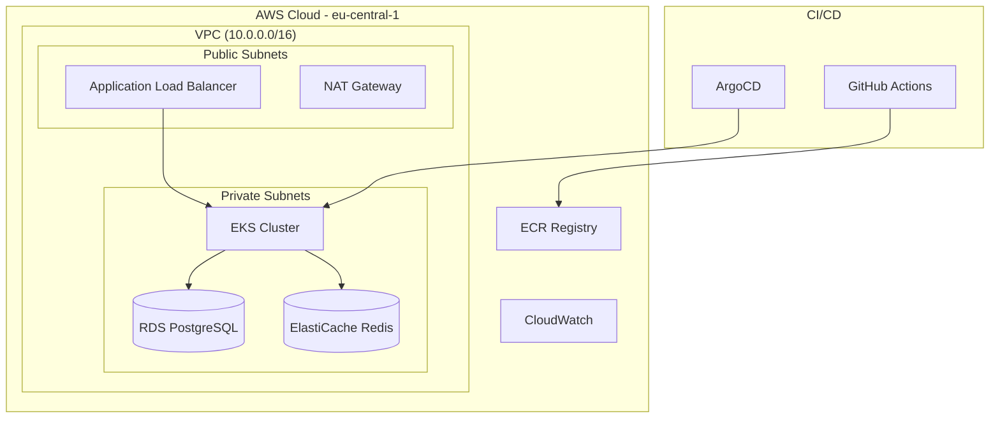

# TByte - Assessment

> **Microservices Platform on AWS EKS**

## Deliverables

| Deliverable | Status | Link |
|-------------|--------|------|
| **Technical Document** | Complete | [Technical Documentation](./docs/technical-documentation.md) |
| **Presentation Deck** | Complete | [Presentation Slides](./docs/presentation.pptx) |
| **Source Code** | Complete | This Repository |

## Project Structure

```
tbyte/
├── .github/          # GitHub Actions CI/CD pipelines
├── apps/             # Helm charts for Kubernetes applications  
├── argocd-apps/      # ArgoCD application definitions (GitOps)
├── docs/             # Technical documentation and assessment tasks
├── scripts/          # Automation scripts for setup and deployment
├── src/              # Application source code (frontend + backend)
└── terragrunt/       # Infrastructure as Code (Terraform modules)
```

## How to Run and Validate the Solution

### Prerequisites
```bash
# Required tools
aws --version        # AWS CLI v2
kubectl version      # Kubernetes CLI  
terragrunt --version # Terragrunt v0.50+
```

### Option 1: Fork and Setup Your Own Environment

#### Setup Multi-Account Structure
```bash
# 1. Fork the repository
git clone https://github.com/YOUR_USERNAME/tbyte.git
cd tbyte

# 2. Update account IDs in configuration
sed -i 's/111111111111/YOUR_DEV_ACCOUNT_ID/g' terragrunt/environments/dev/terragrunt.hcl
sed -i 's/222222222222/YOUR_STAGING_ACCOUNT_ID/g' terragrunt/environments/staging/terragrunt.hcl
sed -i 's/333333333333/YOUR_PROD_ACCOUNT_ID/g' terragrunt/environments/prod/terragrunt.hcl
```

#### Setup GitHub OIDC in All Accounts
```bash
# Option 1: Use the multi-account OIDC setup script (recommended)
./scripts/setup-multi-account-oidc.sh

# This script will:
# 1. Create GitHub OIDC providers in all accounts (dev, staging, prod)
# 2. Create GitHubActionsEKSRole in each account
# 3. Attach AdministratorAccess policies
# 4. Create S3 state buckets for Terragrunt
# 5. Output role ARNs for GitHub secrets

# Option 2: Use environment-specific roles script
./scripts/setup-multi-env-roles.sh

# This creates environment-specific role names:
# - TByteDevGitHubActionsRole
# - TByteStagingGitHubActionsRole 
# - TByteProdGitHubActionsRole

# Prerequisites: AWS Organizations access via oth_infra profile
```

#### Configure GitHub Secrets
```bash
# Current GitHub secrets configured (check with: gh secret list)
# Account IDs
AWS_ACCOUNT_ID_DEV: "111111111111"
AWS_ACCOUNT_ID_STAGING: "222222222222"  
AWS_ACCOUNT_ID_PRODUCTION: "333333333333"
AWS_ACCOUNT_ID_ROOT: "your-root-account-id"

# Role ARNs (depends on which setup script you used)
# If using setup-multi-account-oidc.sh:
AWS_ROLE_ARN_DEV: "arn:aws:iam::111111111111:role/GitHubActionsEKSRole"
AWS_ROLE_ARN_STAGING: "arn:aws:iam::222222222222:role/GitHubActionsEKSRole"
AWS_ROLE_ARN_PRODUCTION: "arn:aws:iam::333333333333:role/GitHubActionsEKSRole"

# If using setup-multi-env-roles.sh:
# AWS_ROLE_ARN_DEV: "arn:aws:iam::111111111111:role/TByteDevGitHubActionsRole"
# AWS_ROLE_ARN_STAGING: "arn:aws:iam::222222222222:role/TByteStagingGitHubActionsRole"
# AWS_ROLE_ARN_PRODUCTION: "arn:aws:iam::333333333333:role/TByteProdGitHubActionsRole"

# ArgoCD GitHub App credentials
ARGOCD_APP_ID: "github-app-id"
ARGOCD_APP_INSTALLATION_ID: "installation-id"
ARGOCD_APP_PRIVATE_KEY: "private-key-pem"

# Repository configuration
GIT_REPO_URL: "https://github.com/chiju/tbyte.git"

# To add secrets to your forked repository:
gh secret set AWS_ACCOUNT_ID_DEV --body "your-dev-account-id"
gh secret set AWS_ROLE_ARN_DEV --body "arn:aws:iam::YOUR_ACCOUNT:role/GitHubActionsEKSRole"
```

#### Deploy via GitHub Actions
```bash
# 1. Push changes to trigger infrastructure deployment
git add .
git commit -m "Setup multi-account configuration"
git push origin main

# 2. Monitor GitHub Actions:
# - Infrastructure Deployment: .github/workflows/terragrunt.yml
# - Application Deployment: .github/workflows/app-cicd.yml

# 3. Deployments run automatically on:
# - Push to main branch
# - Manual trigger via GitHub Actions UI
```

### Validate the Solution

#### 3.1 Infrastructure Validation
```bash
# Check EKS cluster
aws eks describe-cluster --name tbyte-dev --region eu-central-1

# Check RDS instance
aws rds describe-db-instances --region eu-central-1

# Check VPC and subnets
aws ec2 describe-vpcs --filters "Name=tag:Name,Values=tbyte-dev-vpc" --region eu-central-1
```

#### 3.2 Application Validation
```bash
# Check pods are running
kubectl get pods -n tbyte
kubectl get pods -n monitoring
kubectl get pods -n opentelemetry

# Check services and ingress
kubectl get svc -n tbyte
kubectl get rollout -n tbyte
```

#### 3.3 Test Live Application
```bash
# Get the load balancer URL
LB_URL=$(kubectl get svc -n istio-system istio-gateway -o jsonpath='{.status.loadBalancer.ingress[0].hostname}')
echo "Load Balancer URL: $LB_URL"

# Get IP address and add to hosts file
LB_IP=$(nslookup $LB_URL | grep 'Address:' | tail -1 | awk '{print $2}')
echo "$LB_IP tbyte.local" | sudo tee -a /etc/hosts

# Test backend API health endpoint
curl http://tbyte.local/api/health | jq .

# Expected response:
# {
#   "status": "healthy",
#   "timestamp": "2025-12-14T21:40:48.701Z",
#   "service": "tbyte-backend",
#   "version": "1.0.0"
# }

# Test users API (connects to PostgreSQL RDS)
curl http://tbyte.local/api/users | jq .

# Expected response:
# {
#   "success": true,
#   "data": [
#     {
#       "id": 1,
#       "name": "John Doe",
#       "email": "john@tbyte.com",
#       "created_at": "2025-12-14T12:10:14.297Z"
#     }
#   ],
#   "count": 3
# }

# Test frontend in browser
open http://tbyte.local

# Or test frontend via curl
curl http://tbyte.local | head -10
# Expected: HTML page with "TByte Microservices" title
```

#### 3.4 Observability Validation
```bash
# Port forward to access UIs
kubectl port-forward svc/monitoring-grafana -n monitoring 3000:80 &
kubectl port-forward svc/monitoring-kube-prometheus-prometheus -n monitoring 9090:9090 &

# Access URLs:
# Grafana: http://localhost:3000 (admin / prom-operator)
# Prometheus: http://localhost:9090
```

#### 3.5 Test Zero-Downtime Deployment
```bash
# Trigger a new deployment
kubectl patch rollout tbyte-microservices-frontend -n tbyte --type merge \
  -p '{"spec":{"restartAt":"'$(date -u +%Y-%m-%dT%H:%M:%SZ)'"}}'

# Watch canary deployment progress
kubectl get rollout tbyte-microservices-frontend -n tbyte -w

# Check analysis runs
kubectl get analysisrun -n tbyte

# Verify no downtime during deployment
while true; do
  curl -s -H "Host: tbyte.local" http://$LB_URL/api/health | jq -r .status
  sleep 1
done
```

## Architecture Overview



## Technology Stack

| Component | Technology | Purpose |
|-----------|------------|---------|
| **Infrastructure** | Terragrunt + Terraform | Infrastructure as Code |
| **Orchestration** | AWS EKS | Managed Kubernetes |
| **GitOps** | ArgoCD | Continuous Deployment |
| **Monitoring** | Prometheus + Grafana | Metrics & Dashboards |
| **Tracing** | OpenTelemetry + Jaeger | Distributed Tracing |
| **Deployments** | Argo Rollouts | Canary Deployments |
| **CI/CD** | GitHub Actions | Build & Test Pipeline |

## Validation Checklist

- [ ] **Infrastructure**: VPC, EKS, RDS, ElastiCache deployed
- [ ] **Applications**: All ArgoCD apps Synced and Healthy
- [ ] **Monitoring**: Prometheus collecting metrics, Grafana dashboards accessible
- [ ] **Tracing**: OpenTelemetry collector running, Jaeger UI accessible
- [ ] **Deployments**: Canary rollouts working with analysis
- [ ] **Security**: RBAC, Network Policies, Pod Security Standards enabled

## Troubleshooting

### Common Issues and Fixes

**Issue**: `kubectl` cannot connect to cluster
```bash
# Fix: Update kubeconfig
aws eks update-kubeconfig --region eu-central-1 --name tbyte-dev
```

**Issue**: ArgoCD applications stuck in "OutOfSync"
```bash
# Fix: Force sync
kubectl patch application tbyte-microservices -n argocd --type merge -p '{"operation":{"sync":{}}}'
```

**Issue**: Rollout analysis failing
```bash
# Check analysis run details
kubectl describe analysisrun -n tbyte $(kubectl get analysisrun -n tbyte --sort-by=.metadata.creationTimestamp -o name | tail -1)
```

## Support

For detailed technical documentation, architecture decisions, and troubleshooting guides:

### [Complete Technical Documentation](./docs/technical-documentation.md)

## Cleanup

```bash
# Destroy infrastructure (when testing is complete)
cd terragrunt/environments/dev
terragrunt run-all destroy --terragrunt-non-interactive

# This will remove all AWS resources and associated costs
```

---

**Note**: This solution demonstrates production-ready DevOps practices including Infrastructure as Code, GitOps, observability, security, and zero-downtime deployments on AWS EKS.
