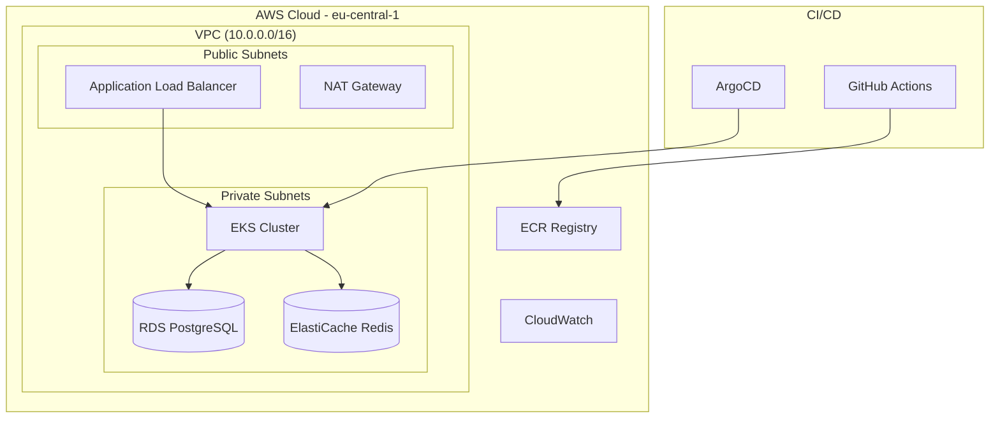

# TByte - Senior DevOps Engineer Assessment

> **Production-Ready Microservices Platform on AWS EKS**

## 📋 Deliverables

| Deliverable | Status | Link |
|-------------|--------|------|
| 📄 **Technical Document** | ✅ Complete | [Technical Documentation](./docs/technical-documentation.md) |
| 🎯 **Presentation Deck** | ✅ Complete | [Presentation Slides](./docs/presentation.ppt) |
| 💻 **Source Code** | ✅ Complete | This Repository |

## 🚀 How to Run and Validate the Solution

### Prerequisites
```bash
# Required tools
aws --version        # AWS CLI v2
kubectl version      # Kubernetes CLI
terragrunt --version # Terragrunt v0.50+
docker --version     # Docker for local testing
```

### Step 1: Deploy Infrastructure with Terraform
```bash
# Clone repository
git clone https://github.com/chiju/tbyte.git
cd tbyte

# Configure AWS credentials
aws configure
# Or export AWS_ACCESS_KEY_ID and AWS_SECRET_ACCESS_KEY

# Deploy infrastructure
cd terragrunt/environments/dev
terragrunt run-all apply --terragrunt-non-interactive

# Expected output: VPC, EKS cluster, RDS, ElastiCache created
# Deployment time: ~15-20 minutes
```

### Step 2: Deploy Kubernetes Manifests
```bash
# Configure kubectl
aws eks update-kubeconfig --region eu-central-1 --name tbyte-dev

# Verify cluster access
kubectl get nodes

# Deploy ArgoCD (GitOps controller)
kubectl apply -k argocd-apps/

# Wait for ArgoCD to be ready
kubectl wait --for=condition=available --timeout=300s deployment/argocd-server -n argocd

# Deploy applications via GitOps
kubectl apply -f argocd-apps/tbyte-microservices.yaml
kubectl apply -f argocd-apps/opentelemetry.yaml
```

### Step 3: Validate the Solution

#### 3.1 Infrastructure Validation
```bash
# Check EKS cluster
aws eks describe-cluster --name tbyte-dev --region eu-central-1

# Check RDS instance
aws rds describe-db-instances --region eu-central-1

# Check VPC and subnets
aws ec2 describe-vpcs --filters "Name=tag:Name,Values=tbyte-dev-vpc" --region eu-central-1
```

#### 3.2 Application Validation
```bash
# Check all applications are synced and healthy
kubectl get applications -n argocd

# Expected output:
# NAME                  SYNC STATUS   HEALTH STATUS
# tbyte-microservices   Synced        Healthy
# opentelemetry         Synced        Healthy

# Check pods are running
kubectl get pods -n tbyte
kubectl get pods -n monitoring
kubectl get pods -n opentelemetry
```

#### 3.3 Observability Validation
```bash
# Port forward to access UIs
kubectl port-forward svc/argocd-server -n argocd 8080:443 &
kubectl port-forward svc/monitoring-grafana -n monitoring 3000:80 &
kubectl port-forward svc/monitoring-kube-prometheus-prometheus -n monitoring 9090:9090 &

# Access URLs:
# ArgoCD: https://localhost:8080 (admin / get password below)
# Grafana: http://localhost:3000 (admin / prom-operator)
# Prometheus: http://localhost:9090
```

#### 3.4 Get Access Credentials
```bash
# ArgoCD admin password
kubectl -n argocd get secret argocd-initial-admin-secret -o jsonpath="{.data.password}" | base64 -d

# Grafana admin password (default: prom-operator)
kubectl get secret monitoring-grafana -n monitoring -o jsonpath="{.data.admin-password}" | base64 -d
```

### Step 4: Test Zero-Downtime Deployment
```bash
# Trigger a new deployment
kubectl patch rollout tbyte-microservices-frontend -n tbyte --type merge -p '{"spec":{"restartAt":"'$(date -u +%Y-%m-%dT%H:%M:%SZ)'"}}'

# Watch canary deployment progress
kubectl get rollout tbyte-microservices-frontend -n tbyte -w

# Check analysis runs
kubectl get analysisrun -n tbyte
```

## 🏗️ Architecture Overview



## 🛠️ Technology Stack

| Component | Technology | Purpose |
|-----------|------------|---------|
| **Infrastructure** | Terragrunt + Terraform | Infrastructure as Code |
| **Orchestration** | AWS EKS | Managed Kubernetes |
| **GitOps** | ArgoCD | Continuous Deployment |
| **Monitoring** | Prometheus + Grafana | Metrics & Dashboards |
| **Tracing** | OpenTelemetry + Jaeger | Distributed Tracing |
| **Deployments** | Argo Rollouts | Canary Deployments |
| **CI/CD** | GitHub Actions | Build & Test Pipeline |

## 🔍 Validation Checklist

- [ ] **Infrastructure**: VPC, EKS, RDS, ElastiCache deployed
- [ ] **Applications**: All ArgoCD apps Synced and Healthy
- [ ] **Monitoring**: Prometheus collecting metrics, Grafana dashboards accessible
- [ ] **Tracing**: OpenTelemetry collector running, Jaeger UI accessible
- [ ] **Deployments**: Canary rollouts working with analysis
- [ ] **Security**: RBAC, Network Policies, Pod Security Standards enabled

## 🚨 Troubleshooting

### Common Issues and Fixes

**Issue**: `kubectl` cannot connect to cluster
```bash
# Fix: Update kubeconfig
aws eks update-kubeconfig --region eu-central-1 --name tbyte-dev
```

**Issue**: ArgoCD applications stuck in "OutOfSync"
```bash
# Fix: Force sync
kubectl patch application tbyte-microservices -n argocd --type merge -p '{"operation":{"sync":{}}}'
```

**Issue**: Rollout analysis failing
```bash
# Check analysis run details
kubectl describe analysisrun -n tbyte $(kubectl get analysisrun -n tbyte --sort-by=.metadata.creationTimestamp -o name | tail -1)
```

## 📞 Support

For detailed technical documentation, architecture decisions, and troubleshooting guides:

### 👉 [📖 Complete Technical Documentation](./docs/technical-documentation.md)

## 🧹 Cleanup

```bash
# Destroy infrastructure (when testing is complete)
cd terragrunt/environments/dev
terragrunt run-all destroy --terragrunt-non-interactive

# This will remove all AWS resources and associated costs
```

---

**Note**: This solution demonstrates production-ready DevOps practices including Infrastructure as Code, GitOps, observability, security, and zero-downtime deployments on AWS EKS.
