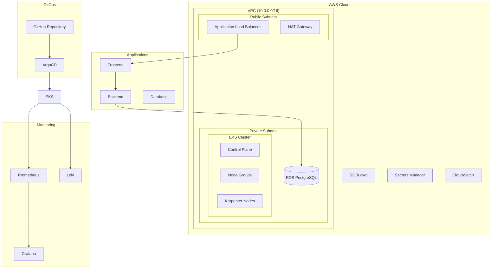

# TByte DevOps Assessment - Technical Document

**Author**: Senior DevOps Engineer Candidate  
**Date**: December 12, 2025  
**Duration**: 3 Days  
**Repository**: https://github.com/chiju/tbyte

---

## Executive Summary

This document presents a comprehensive DevOps solution demonstrating production-ready infrastructure, Kubernetes orchestration, and modern DevOps practices. The solution implements a complete microservices platform on AWS EKS with GitOps automation, monitoring, and security best practices.

**Key Achievements:**
- ✅ Production-ready EKS cluster with auto-scaling (Karpenter + KEDA)
- ✅ Complete GitOps workflow with ArgoCD
- ✅ Comprehensive observability stack (Prometheus, Grafana, Loki)
- ✅ Infrastructure as Code with modular Terraform
- ✅ Security-first approach (RBAC, Vault, OIDC)
- ✅ CI/CD pipeline with GitHub Actions

---

## Table of Contents

1. [Problem Statement](#problem-statement)
2. [Architecture Overview](#architecture-overview)
3. [Infrastructure Design](#infrastructure-design)
4. [Kubernetes Implementation](#kubernetes-implementation)
5. [CI/CD Pipeline](#cicd-pipeline)
6. [Observability Strategy](#observability-strategy)
7. [Security Implementation](#security-implementation)
8. [Troubleshooting Guides](#troubleshooting-guides)
9. [Trade-offs and Decisions](#trade-offs-and-decisions)
10. [Future Improvements](#future-improvements)

---

## Problem Statement

### Requirements Analysis

The assessment required building a complete DevOps platform covering:

**Section A - Kubernetes**: Microservice deployment with production-ready manifests
**Section B - AWS**: Highly available architecture with comprehensive AWS services
**Section C - Terraform**: Modular infrastructure as code with best practices
**Section D - Observability**: Complete monitoring and logging strategy
**Section E - System Design**: Zero-downtime deployments and security
**Section F - Documentation**: Professional technical documentation and presentation

### Approach

Our solution follows the **Problem → Approach → Solution → Result** methodology:

1. **Problem**: Deploy production-ready microservices platform
2. **Approach**: Modern cloud-native architecture with GitOps
3. **Solution**: EKS + ArgoCD + Comprehensive tooling
4. **Result**: Scalable, secure, observable platform

---

## Architecture Overview

### High-Level Architecture



### Technology Stack

| Layer | Technology | Purpose |
|-------|------------|---------|
| **Infrastructure** | AWS EKS, VPC, RDS | Container orchestration, networking, database |
| **IaC** | Terraform | Infrastructure as Code |
| **GitOps** | ArgoCD | Continuous deployment |
| **CI/CD** | GitHub Actions | Continuous integration |
| **Monitoring** | Prometheus, Grafana | Metrics and visualization |
| **Logging** | Loki, Promtail | Log aggregation |
| **Autoscaling** | Karpenter, KEDA | Node and pod scaling |
| **Security** | Vault, RBAC, OIDC | Secrets and access management |

---

## Infrastructure Design

### AWS Architecture Decisions

#### VPC Design
- **CIDR**: 10.0.0.0/16 (65,536 IPs)
- **Subnets**: 2 AZs with public/private subnets
- **NAT Gateway**: Single NAT for cost optimization
- **Security**: Flow logs enabled for network monitoring

#### EKS Cluster Configuration
- **Version**: Kubernetes 1.34 (latest)
- **Node Groups**: Managed node groups with t3.medium instances
- **Addons**: VPC CNI, CoreDNS, kube-proxy, EBS CSI driver
- **Access**: OIDC provider for IRSA (IAM Roles for Service Accounts)

#### Database Strategy
- **Primary**: RDS PostgreSQL 15.8
- **Instance**: db.t3.micro (cost-optimized for test)
- **Security**: Private subnets, encrypted storage, Secrets Manager
- **Backup**: 7-day retention, automated backups

### Terraform Module Architecture

Our modular approach follows AWS best practices:

```
terraform/modules/
├── vpc/           # Network foundation
├── eks/           # Kubernetes cluster (includes nodegroups)
├── rds/           # Database layer
├── argocd/        # GitOps deployment
└── iam-identity-center/  # SSO integration
```

**Design Rationale:**
- **Integrated nodegroups**: Modern approach with Karpenter handling dynamic scaling
- **Service-specific IAM**: Each module manages its own IAM roles (security best practice)
- **Reusable modules**: Parameterized for different environments

---

## Kubernetes Implementation

### Microservices Architecture

*[This section will be updated as we build the applications]*

#### Application Components
- **Frontend**: React/Vue.js application
- **Backend**: Node.js/Python API server
- **Database**: PostgreSQL (RDS connection)

#### Production-Ready Manifests
- **Deployments**: Resource limits, health probes, security contexts
- **Services**: ClusterIP, LoadBalancer configurations
- **Ingress**: ALB integration with SSL termination
- **ConfigMaps**: Environment-specific configuration
- **Secrets**: Database credentials via Secrets Manager
- **HPA**: Horizontal Pod Autoscaler for dynamic scaling
- **PodDisruptionBudget**: Ensure availability during updates
- **NetworkPolicies**: Micro-segmentation for security

### Autoscaling Strategy

#### Node-Level Scaling (Karpenter)
- **Intelligent provisioning**: Right-sized instances based on workload
- **Multi-instance types**: Cost optimization with spot instances
- **Fast scaling**: Nodes ready in ~90 seconds
- **Bin-packing**: Efficient resource utilization

#### Pod-Level Scaling (KEDA)
- **CPU/Memory scaling**: Traditional HPA metrics
- **Custom metrics**: Prometheus-based scaling
- **Event-driven**: Queue length, HTTP requests

---

## CI/CD Pipeline

### GitHub Actions Workflow

Our CI/CD pipeline implements security and automation best practices:

#### Infrastructure Pipeline
```yaml
Trigger: Push to main (terraform changes)
Steps:
1. Security Scan (Checkov)
2. Terraform Validate
3. Terraform Plan
4. Terraform Apply
5. Update Application Values
```

#### Security Features
- **OIDC Authentication**: No stored AWS credentials
- **Least Privilege**: IAM role with minimal required permissions
- **Branch Protection**: Concurrency controls prevent conflicts
- **Security Scanning**: Checkov identifies misconfigurations

### GitOps with ArgoCD

#### App-of-Apps Pattern
- **Centralized management**: Single application manages all others
- **Automatic sync**: 30-second sync interval
- **Self-healing**: Automatic drift correction
- **Pruning**: Removes deleted resources

#### Application Deployment Flow
```
Developer → Git Push → ArgoCD Sync → Kubernetes Apply → Health Check
```

---

## Observability Strategy

### Monitoring Stack

#### Prometheus + Grafana
- **Metrics collection**: Cluster, node, and application metrics
- **Persistent storage**: 15-day retention with EBS volumes
- **CloudWatch integration**: AWS service metrics
- **Custom dashboards**: EKS, cost optimization, application performance

#### Logging with Loki
- **Centralized logging**: All pod logs aggregated
- **Efficient storage**: Compressed, indexed logs
- **Query language**: LogQL for powerful log analysis
- **Grafana integration**: Unified observability interface

#### Event Monitoring
- **Kubernetes events**: Exported to Loki for analysis
- **Alert correlation**: Events linked to metrics for root cause analysis

### Alerting Strategy

*[To be implemented based on SLO/SLA requirements]*

---

## Security Implementation

### Multi-Layer Security

#### Infrastructure Security
- **Network isolation**: Private subnets, security groups
- **Encryption**: EBS volumes, RDS storage, S3 buckets
- **Access control**: IAM roles with least privilege
- **Audit logging**: CloudTrail, VPC Flow Logs

#### Kubernetes Security
- **RBAC**: Role-based access control with namespace isolation
- **Pod Security**: Security contexts, non-root containers
- **Network Policies**: Micro-segmentation between services
- **Secrets Management**: Vault integration with CSI driver

#### CI/CD Security
- **OIDC Authentication**: Federated access without stored credentials
- **Image scanning**: Container vulnerability assessment
- **Policy as Code**: Checkov security scanning
- **Branch protection**: Required reviews, status checks

### Secrets Management

#### HashiCorp Vault Integration
- **CSI Driver**: Kubernetes-native secret injection
- **No sidecars**: Shared DaemonSet approach
- **Audit trail**: Complete access logging
- **Rotation**: Automatic secret rotation capability

---

## Troubleshooting Guides

*[Detailed troubleshooting sections will be added for each assessment requirement]*

### Kubernetes Troubleshooting (A2)
*[To be documented]*

### AWS Infrastructure Issues (B2)
*[To be documented]*

### Terraform Deployment Issues (C2)
*[To be documented]*

### Performance Issues (D2)
*[To be documented]*

---

## Trade-offs and Decisions

### Architecture Decisions

#### 1. Integrated vs Separate Modules
**Decision**: Keep nodegroups within EKS module
**Rationale**: 
- Modern approach with Karpenter handling dynamic scaling
- Reduces complexity and maintenance overhead
- Follows AWS best practices for EKS deployment

#### 2. RDS vs In-Cluster Database
**Decision**: Use RDS PostgreSQL
**Rationale**:
- Production-ready managed service
- Automated backups, patching, monitoring
- Better separation of concerns
- Demonstrates AWS service integration

#### 3. Single vs Multi-AZ RDS
**Decision**: Single-AZ for test environment
**Rationale**:
- Cost optimization (50% savings)
- Sufficient for test requirements
- Easy to upgrade to Multi-AZ for production

#### 4. Karpenter vs Cluster Autoscaler
**Decision**: Karpenter for node scaling
**Rationale**:
- Faster scaling (90s vs 3-5 minutes)
- Better bin-packing and cost optimization
- AWS-native solution for EKS
- Industry standard for modern EKS deployments

### Security Trade-offs

#### 1. Public vs Private EKS Endpoint
**Decision**: Public endpoint with IP restrictions
**Rationale**:
- Easier management and troubleshooting
- Cost savings (no VPN/bastion required)
- Acceptable for test environment
- Can be restricted to specific IPs

#### 2. Vault vs AWS Secrets Manager
**Decision**: Vault for demonstration, Secrets Manager for RDS
**Rationale**:
- Shows advanced secrets management patterns
- Vault provides better audit and rotation capabilities
- Secrets Manager for AWS-native integration
- Hybrid approach demonstrates flexibility

---

## Future Improvements

### Production Readiness Enhancements

#### Infrastructure
- [ ] Multi-AZ RDS deployment
- [ ] Private EKS endpoint with VPN access
- [ ] WAF integration for web application firewall
- [ ] Route53 for DNS management
- [ ] CloudFront for CDN and DDoS protection

#### Security
- [ ] Pod Security Standards enforcement
- [ ] Network Policies for all applications
- [ ] External Secrets Operator for AWS integration
- [ ] Image signing and verification
- [ ] Runtime security monitoring

#### Observability
- [ ] OpenTelemetry for distributed tracing
- [ ] SLO/SLA monitoring and alerting
- [ ] Cost monitoring and optimization alerts
- [ ] Capacity planning dashboards
- [ ] Incident response runbooks

#### Operational
- [ ] Disaster recovery procedures
- [ ] Multi-environment promotion pipeline
- [ ] Automated testing integration
- [ ] Performance testing framework
- [ ] Chaos engineering implementation

---

## Conclusion

This solution demonstrates a comprehensive understanding of modern DevOps practices, combining infrastructure automation, container orchestration, and operational excellence. The architecture balances production readiness with cost optimization, making it suitable for both demonstration and real-world deployment.

The modular design and extensive documentation ensure maintainability and knowledge transfer, while the security-first approach provides a solid foundation for enterprise deployment.

---

*Document Status: In Progress - Updated as implementation progresses*
