# TByte Architecture Diagrams

## High-Level AWS Architecture

```mermaid
graph TB
    subgraph "Internet"
        User[👤 User]
        GitHub[🐙 GitHub Actions]
    end
    
    subgraph "AWS Account"
        subgraph "VPC (10.0.0.0/16)"
            subgraph "Public Subnets"
                ALB[🔄 Application Load Balancer]
                NAT[🌐 NAT Gateway]
            end
            
            subgraph "Private Subnets"
                subgraph "EKS Cluster"
                    subgraph "Nodes"
                        Frontend[⚛️ Frontend Pods]
                        Backend[🔧 Backend Pods]
                        Postgres[🗄️ PostgreSQL Pods]
                        ArgoCD[🔄 ArgoCD]
                        Monitoring[📊 Prometheus/Grafana]
                    end
                end
                
                RDS[(🗄️ RDS PostgreSQL)]
            end
        end
        
        ECR[📦 ECR Registry]
        S3[🪣 S3 Terraform State]
        CloudWatch[📈 CloudWatch]
        SecretsManager[🔐 Secrets Manager]
    end
    
    User --> ALB
    ALB --> Frontend
    Frontend --> Backend
    Backend --> RDS
    Backend --> Postgres
    
    GitHub --> ECR
    GitHub --> S3
    ArgoCD --> GitHub
    
    Monitoring --> CloudWatch
    Backend --> SecretsManager
    
    style Frontend fill:#e1f5fe
    style Backend fill:#f3e5f5
    style Postgres fill:#e8f5e8
    style RDS fill:#fff3e0
    style ArgoCD fill:#fce4ec
```

## GitOps Workflow

```mermaid
graph LR
    Dev[👨‍💻 Developer] --> Git[📝 Git Push]
    Git --> GHA[🔄 GitHub Actions]
    
    subgraph "CI/CD Pipeline"
        GHA --> Build[🔨 Build Images]
        Build --> Test[🧪 Run Tests]
        Test --> Push[📦 Push to ECR]
        Push --> Deploy[🚀 Deploy Infrastructure]
        Deploy --> Update[📝 Update App Configs]
    end
    
    Update --> ArgoCD[🔄 ArgoCD]
    
    subgraph "EKS Cluster"
        ArgoCD --> Sync[🔄 Auto Sync]
        Sync --> Apps[📱 Applications]
        Apps --> Monitor[📊 Monitor Health]
    end
    
    Monitor --> Alert[🚨 Alerts]
    Alert --> Dev
    
    style GHA fill:#f0f8ff
    style ArgoCD fill:#fce4ec
    style Apps fill:#e8f5e8
```

## Kubernetes Application Architecture

## Security Architecture

## Monitoring & Observability

## How to Use These Diagrams

1. **Copy the Mermaid code** from any diagram above
2. **Paste into online tools**:
   - [Mermaid Live Editor](https://mermaid.live/)
   - [Draw.io](https://app.diagrams.net/) (supports Mermaid import)
   - VS Code with Mermaid extension
3. **Export as PNG/SVG** for your presentation
4. **Include in documentation** or PowerPoint slides

## Architecture Highlights

- **High Availability**: Multi-AZ deployment with auto-scaling
- **Security**: Zero-trust model with encryption everywhere
- **Observability**: 360° monitoring with metrics, logs, and events
- **Automation**: GitOps workflow with infrastructure as code
- **Cost Optimization**: Right-sizing with Karpenter and resource limits
