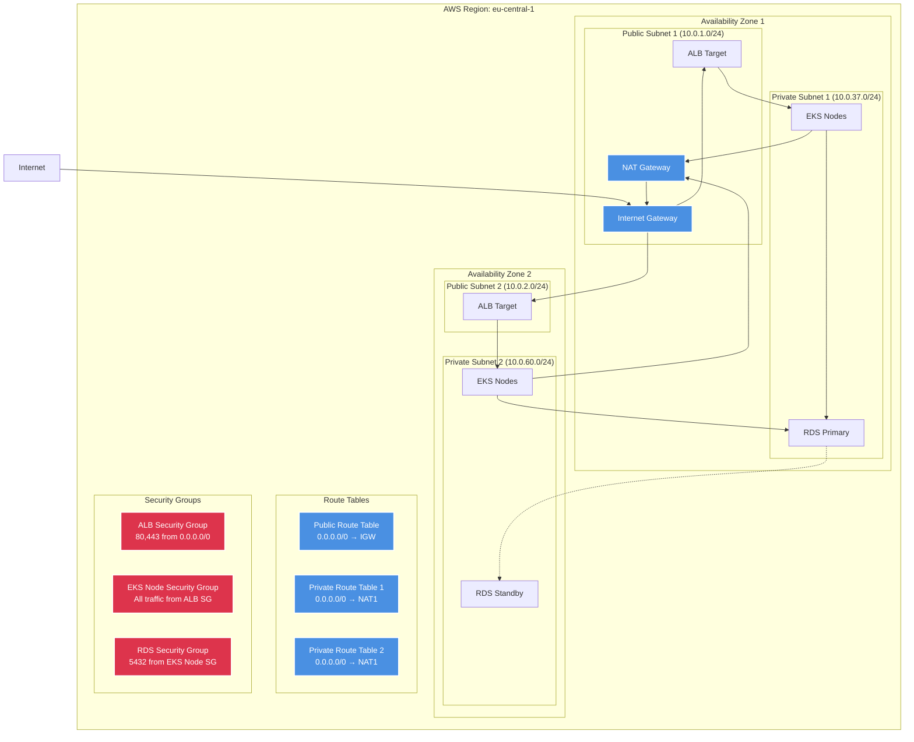
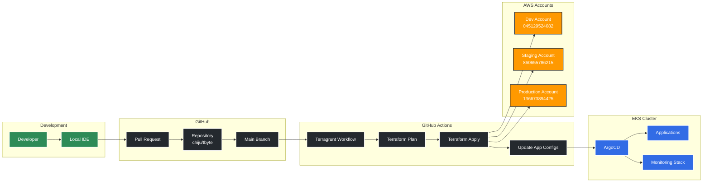

# AWS Architecture Diagram - TByte Multi-Account Setup

## High-Level Architecture

```mermaid
graph TB
    subgraph "AWS Organizations"
        subgraph "Root Account (432801802107)"
            OrgMgmt[Organization Management]
            S3State[S3 Terraform State]
            IAMOrg[Organization Roles]
        end
        
        subgraph "Dev Account (045129524082)"
            subgraph "VPC Dev (10.0.0.0/16)"
                subgraph "Public Subnets"
                    PubSub1[Public Subnet AZ-1<br/>10.0.1.0/24]
                    PubSub2[Public Subnet AZ-2<br/>10.0.2.0/24]
                    ALB[Application Load Balancer]
                    NAT[NAT Gateway]
                end
                
                subgraph "Private Subnets"
                    PrivSub1[Private Subnet AZ-1<br/>10.0.37.0/24]
                    PrivSub2[Private Subnet AZ-2<br/>10.0.60.0/24]
                    
                    subgraph "EKS Cluster"
                        EKSControl[EKS Control Plane]
                        NodeGroup1[Node Group AZ-1<br/>t3.medium]
                        NodeGroup2[Node Group AZ-2<br/>t3.medium]
                        
                        subgraph "Workloads"
                            Frontend[Frontend Pods]
                            Backend[Backend Pods]
                            ArgoCD[ArgoCD]
                            Monitoring[Prometheus/Grafana]
                            Karpenter[Karpenter]
                        end
                    end
                    
                    RDS[RDS PostgreSQL<br/>Multi-AZ<br/>db.t3.micro]
                end
            end
            
            subgraph "Security & IAM"
                DevRole[TByteDevGitHubActionsRole]
                OIDC[GitHub OIDC Provider]
                KMS[KMS Keys]
            end
            
            subgraph "Monitoring"
                CW[CloudWatch Logs/Metrics]
                CWAlarms[CloudWatch Alarms]
            end
        end
        
        subgraph "Staging Account (860655786215)"
            StagingVPC[VPC Staging<br/>Ready for deployment]
            StagingRole[TByteStagingGitHubActionsRole]
        end
        
        subgraph "Production Account (136673894425)"
            ProdVPC[VPC Production<br/>Ready for deployment]
            ProdRole[TByteProdGitHubActionsRole]
        end
    end
    
    subgraph "External Services"
        GitHub[GitHub Repository<br/>chiju/tbyte]
        GitHubActions[GitHub Actions<br/>CI/CD Pipeline]
        Internet[Internet Users]
    end
    
    %% Connections
    Internet --> ALB
    ALB --> Frontend
    Frontend --> Backend
    Backend --> RDS
    
    GitHub --> GitHubActions
    GitHubActions --> DevRole
    GitHubActions --> StagingRole
    GitHubActions --> ProdRole
    
    DevRole --> EKSControl
    ArgoCD --> GitHub
    
    NAT --> Internet
    PrivSub1 --> NAT
    PrivSub2 --> NAT
    
    EKSControl --> NodeGroup1
    EKSControl --> NodeGroup2
    
    Monitoring --> CW
    CW --> CWAlarms
    
    %% Styling
    classDef aws fill:#FF9900,stroke:#232F3E,stroke-width:2px,color:#fff
    classDef k8s fill:#326CE5,stroke:#fff,stroke-width:2px,color:#fff
    classDef security fill:#DD344C,stroke:#fff,stroke-width:2px,color:#fff
    classDef external fill:#2E8B57,stroke:#fff,stroke-width:2px,color:#fff
    
    class ALB,NAT,RDS,CW,CWAlarms,KMS aws
    class EKSControl,NodeGroup1,NodeGroup2,Frontend,Backend,ArgoCD,Monitoring,Karpenter k8s
    class DevRole,StagingRole,ProdRole,OIDC,IAMOrg security
    class GitHub,GitHubActions,Internet external
```

## Network Architecture Detail

## GitOps & CI/CD Flow

## Security Architecture

```mermaid
graph TB
    subgraph "Identity & Access Management"
        subgraph "GitHub Actions Authentication"
            OIDC[GitHub OIDC Provider]
            DevRole[TByteDevGitHubActionsRole]
            StagingRole[TByteStagingGitHubActionsRole]
            ProdRole[TByteProdGitHubActionsRole]
        end
        
        subgraph "EKS Security"
            IRSA[IAM Roles for Service Accounts]
            KarpenterRole[Karpenter Controller Role]
            GrafanaRole[Grafana CloudWatch Role]
            RBAC[Kubernetes RBAC]
        end
        
        subgraph "Data Protection"
            KMS[KMS Encryption]
            S3Encryption[S3 State Encryption]
            RDSEncryption[RDS Encryption at Rest]
            EBSEncryption[EBS Encryption]
        end
    end
    
    subgraph "Network Security"
        subgraph "VPC Security"
            NACLs[Network ACLs]
            SecurityGroups[Security Groups]
            PrivateSubnets[Private Subnets]
        end
        
        subgraph "Application Security"
            NetworkPolicies[Kubernetes Network Policies]
            PodSecurity[Pod Security Standards]
            SecretManagement[Secrets Management]
        end
    end
    
    subgraph "Monitoring & Compliance"
        CloudTrail[AWS CloudTrail]
        VPCFlowLogs[VPC Flow Logs]
        ContainerInsights[Container Insights]
        SecurityAlerts[Security Alerts]
    end
    
    OIDC --> DevRole
    OIDC --> StagingRole
    OIDC --> ProdRole
    
    DevRole --> IRSA
    IRSA --> KarpenterRole
    IRSA --> GrafanaRole
    IRSA --> RBAC
    
    KMS --> S3Encryption
    KMS --> RDSEncryption
    KMS --> EBSEncryption
    
    SecurityGroups --> NetworkPolicies
    NetworkPolicies --> PodSecurity
    PodSecurity --> SecretManagement
    
    CloudTrail --> SecurityAlerts
    VPCFlowLogs --> SecurityAlerts
    ContainerInsights --> SecurityAlerts
    
    classDef security fill:#DD344C,stroke:#fff,stroke-width:2px,color:#fff
    classDef network fill:#4A90E2,stroke:#fff,stroke-width:2px,color:#fff
    classDef monitoring fill:#7B68EE,stroke:#fff,stroke-width:2px,color:#fff
    
    class OIDC,DevRole,StagingRole,ProdRole,IRSA,KarpenterRole,GrafanaRole,RBAC,KMS,S3Encryption,RDSEncryption,EBSEncryption security
    class NACLs,SecurityGroups,PrivateSubnets,NetworkPolicies,PodSecurity,SecretManagement network
    class CloudTrail,VPCFlowLogs,ContainerInsights,SecurityAlerts monitoring
```

## Cost Optimization Strategy

| Component | Current Cost | Optimization | Potential Savings |
|-----------|-------------|--------------|-------------------|
| EKS Control Plane | $73/month | None (fixed cost) | $0 |
| EC2 Instances | $60/month | Karpenter + Spot | 60-90% |
| RDS PostgreSQL | $13/month | Right-sizing | 20-30% |
| NAT Gateway | $32/month | NAT Instance for dev | 70% |
| Data Transfer | $5/month | CloudFront CDN | 40% |
| **Total** | **$183/month** | **Combined optimizations** | **$80-120/month** |

## High Availability & Disaster Recovery

### HA Strategy
- **Multi-AZ Deployment**: Resources across 2 availability zones
- **Auto Scaling**: Karpenter for intelligent node scaling
- **Load Balancing**: Application Load Balancer with health checks
- **Database**: RDS Multi-AZ with automated backups

### DR Strategy
- **RTO**: 15 minutes (automated failover)
- **RPO**: 5 minutes (continuous replication)
- **Backup**: Daily automated snapshots
- **Cross-Region**: Ready for production expansion

### Monitoring & Alerting
- **Infrastructure**: CloudWatch metrics and alarms
- **Applications**: Prometheus + Grafana dashboards
- **Logs**: Centralized logging with Loki
- **Events**: Kubernetes events in Grafana

## Future Enhancements

### Production Readiness
1. **Private EKS Endpoints**: Restrict API server access
2. **WAF Integration**: Web Application Firewall
3. **Certificate Management**: AWS Certificate Manager
4. **Backup Strategy**: Velero for Kubernetes backups
5. **Multi-Region**: Cross-region replication

### Security Enhancements
1. **External Secrets Operator**: AWS Secrets Manager integration
2. **Pod Security Policies**: Enforce security standards
3. **Image Scanning**: Container vulnerability scanning
4. **Network Policies**: Micro-segmentation
5. **Compliance**: SOC2/ISO27001 controls
