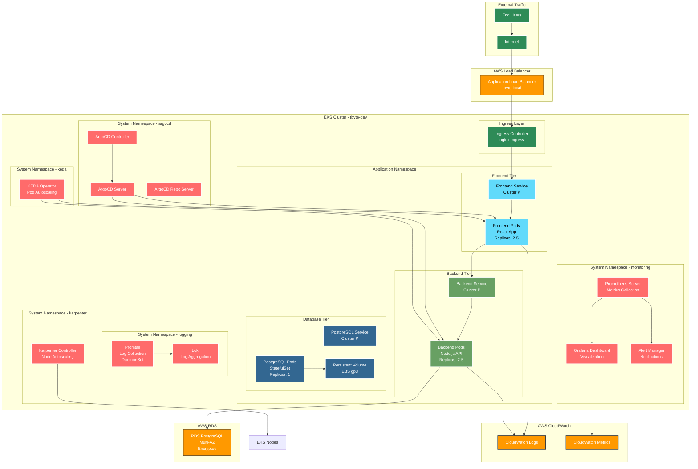
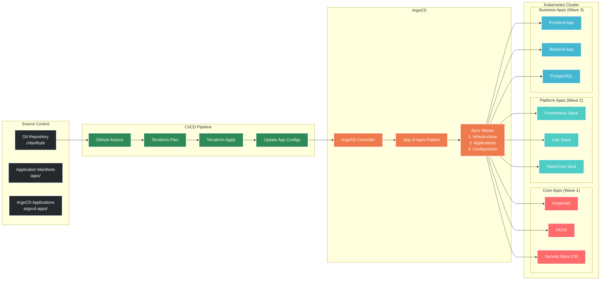
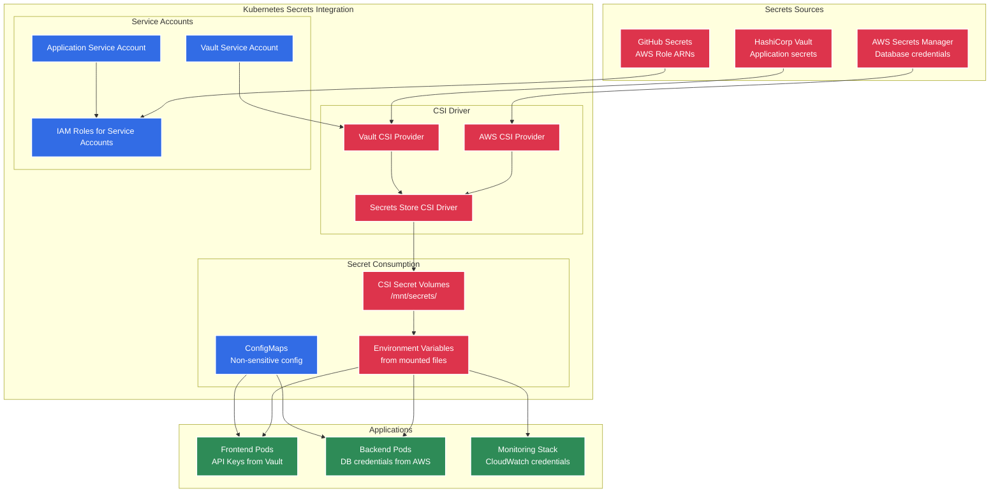
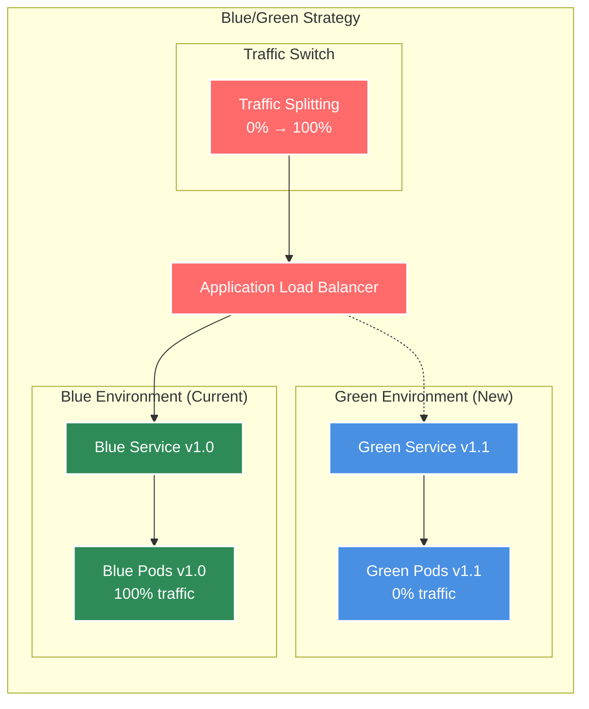
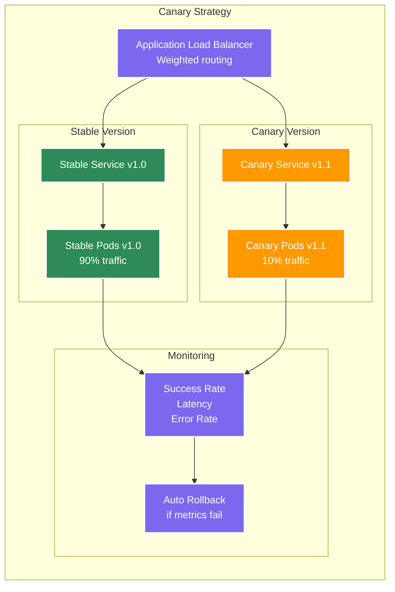

# Kubernetes Architecture - TByte Microservices Platform

## Application Architecture



## Pod Security & Resource Management

```mermaid
graph TB
    subgraph "Pod Security Context"
        subgraph "Security Standards"
            NonRoot[runAsNonUser: true<br/>runAsUser: 1000]
            ReadOnlyFS[readOnlyRootFilesystem: true]
            NoPrivileged[allowPrivilegeEscalation: false]
            Capabilities[drop: ALL<br/>add: NET_BIND_SERVICE]
        end
        
        subgraph "Resource Limits"
            CPULimits[CPU Limits<br/>requests: 100m<br/>limits: 500m]
            MemoryLimits[Memory Limits<br/>requests: 128Mi<br/>limits: 512Mi]
            EphemeralStorage[Ephemeral Storage<br/>requests: 1Gi<br/>limits: 2Gi]
        end
        
        subgraph "Health Checks"
            LivenessProbe[Liveness Probe<br/>HTTP /health<br/>initialDelay: 30s]
            ReadinessProbe[Readiness Probe<br/>HTTP /ready<br/>initialDelay: 5s]
            StartupProbe[Startup Probe<br/>HTTP /startup<br/>failureThreshold: 30]
        end
    end
    
    subgraph "Autoscaling Configuration"
        subgraph "Horizontal Pod Autoscaler"
            HPACPUTarget[CPU Target: 70%]
            HPAMemoryTarget[Memory Target: 80%]
            HPAMinReplicas[Min Replicas: 2]
            HPAMaxReplicas[Max Replicas: 10]
        end
        
        subgraph "KEDA Scaling"
            KEDACPUScaler[CPU Scaler<br/>Target: 70%]
            KEDAMemoryScaler[Memory Scaler<br/>Target: 80%]
            KEDACustomMetrics[Custom Metrics<br/>Prometheus queries]
        end
        
        subgraph "Pod Disruption Budget"
            PDBMinAvailable[minAvailable: 50%]
            PDBMaxUnavailable[maxUnavailable: 1]
        end
    end
    
    subgraph "Network Policies"
        subgraph "Ingress Rules"
            AllowIngress[Allow from Ingress<br/>Port 80, 443]
            AllowMonitoring[Allow from Monitoring<br/>Port 8080, 9090]
        end
        
        subgraph "Egress Rules"
            AllowDNS[Allow DNS<br/>Port 53]
            AllowHTTPS[Allow HTTPS<br/>Port 443]
            AllowDatabase[Allow Database<br/>Port 5432]
        end
        
        subgraph "Deny Rules"
            DenyDefault[Deny All Other Traffic]
        end
    end
    
    classDef security fill:#DD344C,stroke:#fff,stroke-width:2px,color:#fff
    classDef resources fill:#4A90E2,stroke:#fff,stroke-width:2px,color:#fff
    classDef scaling fill:#7B68EE,stroke:#fff,stroke-width:2px,color:#fff
    classDef network fill:#2E8B57,stroke:#fff,stroke-width:2px,color:#fff
    
    class NonRoot,ReadOnlyFS,NoPrivileged,Capabilities security
    class CPULimits,MemoryLimits,EphemeralStorage,LivenessProbe,ReadinessProbe,StartupProbe resources
    class HPACPUTarget,HPAMemoryTarget,HPAMinReplicas,HPAMaxReplicas,KEDACPUScaler,KEDAMemoryScaler,KEDACustomMetrics,PDBMinAvailable,PDBMaxUnavailable scaling
    class AllowIngress,AllowMonitoring,AllowDNS,AllowHTTPS,AllowDatabase,DenyDefault network
```



## GitOps Deployment Flow



## Secrets Management Architecture



## Monitoring & Observability Stack

```mermaid
graph TB
    subgraph "Data Sources"
        subgraph "Metrics"
            K8sMetrics[Kubernetes Metrics<br/>kube-state-metrics]
            NodeMetrics[Node Metrics<br/>node-exporter]
            AppMetrics[Application Metrics<br/>Custom /metrics endpoints]
            AWSMetrics[AWS CloudWatch<br/>EKS, RDS, ALB metrics]
        end
        
        subgraph "Logs"
            ContainerLogs[Container Logs<br/>stdout/stderr]
            K8sEvents[Kubernetes Events<br/>event-exporter]
            AWSLogs[AWS CloudWatch Logs<br/>EKS control plane]
        end
        
        subgraph "Traces"
            AppTraces[Application Traces<br/>OpenTelemetry]
            ServiceMesh[Service Mesh Traces<br/>Istio (future)]
        end
    end
    
    subgraph "Collection Layer"
        Prometheus[Prometheus<br/>Metrics scraping<br/>15 days retention]
        Promtail[Promtail DaemonSet<br/>Log collection]
        OTelCollector[OpenTelemetry Collector<br/>Trace collection]
    end
    
    subgraph "Storage Layer"
        PrometheusStorage[Prometheus Storage<br/>Local SSD + EBS]
        LokiStorage[Loki Storage<br/>S3 backend]
        JaegerStorage[Jaeger Storage<br/>Elasticsearch]
    end
    
    subgraph "Visualization Layer"
        Grafana[Grafana Dashboards<br/>Metrics + Logs + Traces]
        AlertManager[Alert Manager<br/>Slack notifications]
        
        subgraph "Dashboards"
            ClusterDash[EKS Cluster Overview]
            AppDash[Application Performance]
            CostDash[Cost Optimization]
            SecurityDash[Security Monitoring]
        end
    end
    
    subgraph "External Integrations"
        Slack[Slack Notifications]
        PagerDuty[PagerDuty (future)]
        Email[Email Alerts]
    end
    
    %% Metrics Flow
    K8sMetrics --> Prometheus
    NodeMetrics --> Prometheus
    AppMetrics --> Prometheus
    AWSMetrics --> Grafana
    
    %% Logs Flow
    ContainerLogs --> Promtail
    K8sEvents --> Promtail
    AWSLogs --> Grafana
    
    %% Traces Flow
    AppTraces --> OTelCollector
    ServiceMesh --> OTelCollector
    
    %% Storage
    Prometheus --> PrometheusStorage
    Promtail --> LokiStorage
    OTelCollector --> JaegerStorage
    
    %% Visualization
    PrometheusStorage --> Grafana
    LokiStorage --> Grafana
    JaegerStorage --> Grafana
    
    Prometheus --> AlertManager
    AlertManager --> Slack
    AlertManager --> Email
    
    Grafana --> ClusterDash
    Grafana --> AppDash
    Grafana --> CostDash
    Grafana --> SecurityDash
    
    classDef metrics fill:#E6522C,stroke:#fff,stroke-width:2px,color:#fff
    classDef logs fill:#F46800,stroke:#fff,stroke-width:2px,color:#fff
    classDef traces fill:#9C27B0,stroke:#fff,stroke-width:2px,color:#fff
    classDef storage fill:#4A90E2,stroke:#fff,stroke-width:2px,color:#fff
    classDef viz fill:#2E8B57,stroke:#fff,stroke-width:2px,color:#fff
    classDef external fill:#FF6B6B,stroke:#fff,stroke-width:2px,color:#fff
    
    class K8sMetrics,NodeMetrics,AppMetrics,AWSMetrics,Prometheus,PrometheusStorage metrics
    class ContainerLogs,K8sEvents,AWSLogs,Promtail,LokiStorage logs
    class AppTraces,ServiceMesh,OTelCollector,JaegerStorage traces
    class PrometheusStorage,LokiStorage,JaegerStorage storage
    class Grafana,AlertManager,ClusterDash,AppDash,CostDash,SecurityDash viz
    class Slack,PagerDuty,Email external
```

## Deployment Strategies

### Rolling Deployment (Current)
```yaml
strategy:
  type: RollingUpdate
  rollingUpdate:
    maxUnavailable: 25%
    maxSurge: 25%
```

### Blue/Green Deployment (Future)


### Canary Deployment (Future)


## Resource Optimization

| Resource Type | Current | Optimized | Savings |
|---------------|---------|-----------|---------|
| **CPU Requests** | 100m per pod | Right-sized based on metrics | 30% |
| **Memory Requests** | 128Mi per pod | Right-sized based on metrics | 25% |
| **Node Utilization** | 60% average | Karpenter bin-packing 85% | 40% |
| **Storage** | gp2 volumes | gp3 volumes | 20% |
| **Network** | Standard ALB | ALB with compression | 15% |

## Security Compliance

### Pod Security Standards
- **Restricted**: All application pods
- **Baseline**: System pods (monitoring, logging)
- **Privileged**: Infrastructure pods (CSI drivers)

### Network Security
- **Default Deny**: All network policies start with deny-all
- **Least Privilege**: Only required ports and protocols
- **Encryption**: TLS for all inter-service communication
- **Segmentation**: Namespace-based isolation

### RBAC Configuration
```yaml
# Example RBAC for application
apiVersion: rbac.authorization.k8s.io/v1
kind: Role
metadata:
  name: app-reader
rules:
- apiGroups: [""]
  resources: ["pods", "services", "configmaps"]
  verbs: ["get", "list", "watch"]
```
