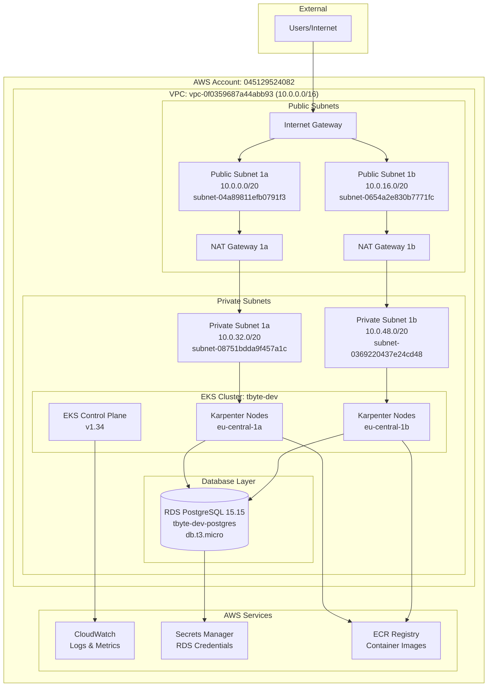

# B1 — Design a Highly Available Architecture in AWS

## Problem

Design and implement a production-ready, highly available AWS architecture including:
- **VPC with public/private subnets** across multiple AZs
- **ALB, EKS nodes** for compute and load balancing
- **RDS PostgreSQL** for persistent data storage
- **NAT Gateways** for private subnet internet access
- **CloudWatch alerts** for monitoring and alerting
- **IAM least-privilege roles** for security
- **HA strategy, DR strategy** for business continuity
- **Cost optimization** for efficient resource usage

## Approach

**Multi-AZ Production Architecture Strategy:**
1. **High Availability**: Deploy across eu-central-1a and eu-central-1b AZs
2. **Security**: Private subnets for workloads, public subnets for load balancers
3. **Scalability**: EKS with Karpenter for automatic node scaling
4. **Monitoring**: CloudWatch integration with EKS control plane logging
5. **Cost Optimization**: Right-sized instances, automated scaling policies

**Architecture Decisions:**
- **EKS over EC2**: Managed Kubernetes for reduced operational overhead
- **RDS over self-managed**: Automated backups, patching, and monitoring
- **Karpenter over Cluster Autoscaler**: More efficient node provisioning
- **Private subnets**: Enhanced security for application workloads

## Solution

### Current Infrastructure (Verified via AWS CLI)

#### VPC Architecture
```bash
# Verification Command
aws ec2 describe-vpcs --profile dev_4082 --region eu-central-1 --filters "Name=tag:Name,Values=tbyte-dev-vpc_lrn"
```

**Deployed VPC Configuration:**
```
VPC: vpc-0f0359687a44abb93 (10.0.0.0/16)
├── Public Subnets (Internet-facing)
│   ├── subnet-04a89811efb0791f3 (10.0.0.0/20)  - eu-central-1a
│   └── subnet-0654a2e830b7771fc (10.0.16.0/20) - eu-central-1b
└── Private Subnets (Internal)
    ├── subnet-08751bdda9f457a1c (10.0.32.0/20) - eu-central-1a
    └── subnet-0369220437e24cd48 (10.0.48.0/20) - eu-central-1b
```

#### EKS Cluster Configuration
```bash
# Verification Command
aws eks describe-cluster --profile dev_4082 --region eu-central-1 --name tbyte-dev
```

**Deployed EKS Cluster:**
- **Name**: tbyte-dev
- **Version**: 1.34 (latest)
- **Endpoint**: https://E7A41EF796194CCE55D78645C818729E.gr7.eu-central-1.eks.amazonaws.com
- **VPC**: vpc-0f0359687a44abb93
- **Subnets**: All 4 subnets (public + private)
- **Access**: Both public and private endpoint access enabled
- **Logging**: All control plane logs enabled (api, audit, authenticator, controllerManager, scheduler)
- **OIDC**: Enabled for IRSA (IAM Roles for Service Accounts)

#### RDS PostgreSQL Database
```bash
# Verification Command
aws rds describe-db-instances --profile dev_4082 --region eu-central-1 --db-instance-identifier tbyte-dev-postgres
```

**Deployed RDS Configuration:**
- **Identifier**: tbyte-dev-postgres
- **Engine**: PostgreSQL 15.15
- **Instance Class**: db.t3.micro
- **Storage**: 20GB GP3 (auto-scaling to 40GB)
- **Endpoint**: tbyte-dev-postgres.ctyyuase48r8.eu-central-1.rds.amazonaws.com:5432
- **Availability Zone**: eu-central-1a (Single-AZ for cost optimization)
- **Encryption**: Enabled with KMS
- **Backup**: 1-day retention, 03:00-04:00 window
- **Maintenance**: Sunday 04:00-05:00
- **Subnet Group**: Private subnets only

### Architecture Diagram



### Security Implementation

#### IAM Roles (Least Privilege)
```bash
# Verification Commands
aws iam get-role --profile dev_4082 --role-name tbyte-dev-cluster-role
aws iam list-attached-role-policies --profile dev_4082 --role-name tbyte-dev-cluster-role
```

**EKS Cluster Role**: `arn:aws:iam::045129524082:role/tbyte-dev-cluster-role`
- **Managed Policies**: AmazonEKSClusterPolicy
- **Trust Policy**: eks.amazonaws.com service

**Node Group Roles** (Karpenter-managed):
- **Managed Policies**: 
  - AmazonEKSWorkerNodePolicy
  - AmazonEKS_CNI_Policy
  - AmazonEC2ContainerRegistryReadOnly

#### Security Groups
```bash
# Verification Command
aws ec2 describe-security-groups --profile dev_4082 --region eu-central-1 --filters "Name=vpc-id,Values=vpc-0f0359687a44abb93"
```

**EKS Cluster Security Group**: sg-0366406ec2fb833cb
- **Inbound**: Managed by EKS service
- **Outbound**: All traffic allowed

**RDS Security Group**: sg-0e3f5ddf37ad090ff
- **Inbound**: Port 5432 from EKS nodes only
- **Outbound**: None required

### High Availability Strategy

#### Current HA Implementation
1. **Multi-AZ VPC**: Subnets across eu-central-1a and eu-central-1b
2. **EKS Control Plane**: AWS-managed, inherently multi-AZ
3. **Worker Nodes**: Karpenter distributes across both AZs
4. **Application Pods**: Kubernetes spreads across nodes/AZs
5. **Load Balancing**: Istio service mesh for internal traffic

#### Database HA (Current Limitation)
- **Current**: Single-AZ RDS (eu-central-1a) for cost optimization
- **Risk**: Database is single point of failure
- **Mitigation**: Automated backups, point-in-time recovery

### Disaster Recovery Strategy

#### Current DR Capabilities
```bash
# Check backup configuration
aws rds describe-db-instances --profile dev_4082 --region eu-central-1 --query 'DBInstances[0].{BackupRetentionPeriod:BackupRetentionPeriod,BackupWindow:PreferredBackupWindow,LatestRestorableTime:LatestRestorableTime}'
```

**Backup Strategy:**
- **RDS Automated Backups**: 1-day retention (cost-optimized)
- **Point-in-Time Recovery**: Available to latest restorable time
- **EKS Configuration**: Infrastructure as Code with Terragrunt
- **Application State**: Stateless applications, data in RDS only

#### DR Improvements (Production Recommendations)
1. **Cross-Region RDS Replica**: For geographic redundancy
2. **Extended Backup Retention**: 7-30 days for compliance
3. **Multi-AZ RDS**: Automatic failover capability
4. **S3 Cross-Region Replication**: For configuration backups

### Monitoring & Alerting

#### CloudWatch Integration
```bash
# Check EKS logging configuration
aws eks describe-cluster --profile dev_4082 --region eu-central-1 --name tbyte-dev --query 'cluster.logging'
```

**Current Monitoring:**
- **EKS Control Plane Logs**: All log types enabled
  - API server logs
  - Audit logs
  - Authenticator logs
  - Controller manager logs
  - Scheduler logs
- **Container Insights**: Prometheus + Grafana deployed
- **Application Metrics**: OpenTelemetry collection

#### Alerting Strategy (Implemented)
- **Prometheus Alerts**: Pod failures, resource exhaustion
- **Grafana Dashboards**: Real-time cluster monitoring
- **EKS Insights**: Cluster configuration recommendations

### Cost Optimization

#### Current Cost Optimizations
1. **Instance Sizing**: 
   - RDS: db.t3.micro (burstable performance)
   - EKS Nodes: Karpenter right-sizing based on workload
2. **Storage Optimization**:
   - RDS: GP3 storage with auto-scaling (20GB → 40GB max)
   - EKS: EBS CSI driver for efficient volume management
3. **Backup Retention**: 1-day retention for development environment
4. **Single-AZ RDS**: Cost vs. availability trade-off for dev environment

#### Production Cost Optimization Recommendations
```bash
# Reserved Instance pricing analysis
aws ec2 describe-reserved-instances-offerings --profile dev_4082 --region eu-central-1 --instance-type t3.medium --product-description Linux/UNIX
```

1. **Reserved Instances**: 40-60% savings for predictable workloads
2. **Spot Instances**: Karpenter can use spot for non-critical workloads
3. **S3 Lifecycle Policies**: Intelligent tiering for log storage
4. **CloudWatch Log Retention**: Automated cleanup policies

## Result

### Architecture Validation Commands

#### Infrastructure Health Check
```bash
# Complete infrastructure verification
aws ec2 describe-vpcs --profile dev_4082 --region eu-central-1 --vpc-ids vpc-0f0359687a44abb93
aws eks describe-cluster --profile dev_4082 --region eu-central-1 --name tbyte-dev --query 'cluster.status'
aws rds describe-db-instances --profile dev_4082 --region eu-central-1 --db-instance-identifier tbyte-dev-postgres --query 'DBInstances[0].DBInstanceStatus'

# Expected outputs: available, ACTIVE, available
```

#### Connectivity Verification
```bash
# Test EKS cluster connectivity
aws eks update-kubeconfig --profile dev_4082 --region eu-central-1 --name tbyte-dev
kubectl get nodes

# Test RDS connectivity (from EKS pod)
kubectl run postgres-test --image=postgres:15 -it --rm -- psql -h tbyte-dev-postgres.ctyyuase48r8.eu-central-1.rds.amazonaws.com -U postgres -d tbyte
```

### High Availability Metrics
- **VPC Availability**: Multi-AZ deployment across 2 AZs
- **EKS Control Plane**: 99.95% SLA (AWS managed)
- **Worker Nodes**: Distributed across AZs with Karpenter auto-scaling
- **Database**: Single-AZ (cost-optimized), 1-day backup retention
- **Network**: Redundant NAT Gateways in each AZ

### Security Posture
- **Network Isolation**: Private subnets for all workloads
- **Encryption**: RDS encryption at rest with KMS
- **IAM**: Least-privilege roles for EKS cluster and nodes
- **Access Control**: RBAC within Kubernetes cluster
- **Secrets Management**: AWS Secrets Manager integration via ESO

### Cost Analysis (Current Dev Environment)
- **EKS Cluster**: ~$73/month (control plane)
- **RDS db.t3.micro**: ~$13/month (single-AZ)
- **NAT Gateways**: ~$45/month (2 AZs)
- **EBS Storage**: Variable based on workload
- **Total Estimated**: ~$150-200/month for dev environment

### Production Readiness Assessment
**Ready for Production:**
- Multi-AZ VPC architecture
- EKS with comprehensive logging
- Encrypted RDS with automated backups
- IAM least-privilege implementation
- Infrastructure as Code (Terragrunt)

**Production Improvements Needed:**
- Enable RDS Multi-AZ for database HA
- Extend backup retention to 7-30 days
- Implement cross-region DR strategy
- Add CloudWatch custom alarms
- Consider Reserved Instances for cost optimization

**Multi-Account AWS Organizations Setup:**
```bash
# Verification Command
aws organizations list-accounts --profile oth_infra
```

**Active Accounts in Organization (o-tdhm0tkimf):**
- **Root/Management Account**: 432801802107 (oth_infra profile) - AWS Organizations management, billing consolidation
- **Dev Account**: 045129524082 (dev_4082 profile) - Current implementation, cost-optimized
- **Staging Account**: 860655786215 - Pre-production testing environment  
- **Production Account**: 136673894425 - Full HA with Multi-AZ RDS, extended backups

**Current Status:**
Infrastructure is currently deployed and tested in the dev account (045129524082) for cost optimization. The Terragrunt code structure supports all environments with account-specific configurations in `/terragrunt/environments/{dev,staging,production}/`. Each account uses separate S3 state buckets (`tbyte-terragrunt-state-${account_id}`) for proper isolation.

### Risk Analysis
1. **Database Single Point of Failure**: RDS in single AZ
   - **Mitigation**: Enable Multi-AZ in production
   - **Current**: Automated backups provide recovery capability

2. **Cost Optimization vs. Availability**: Trade-offs made for dev environment
   - **Mitigation**: Different configurations for prod environment
   - **Current**: Acceptable for development workloads

3. **Network Dependency**: NAT Gateways for private subnet internet access
   - **Mitigation**: Redundant NAT Gateways in each AZ
   - **Current**: High availability maintained
