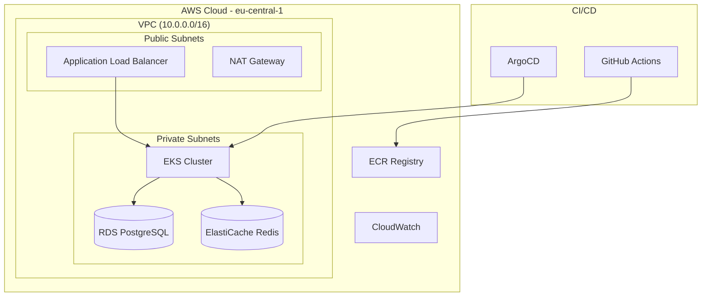
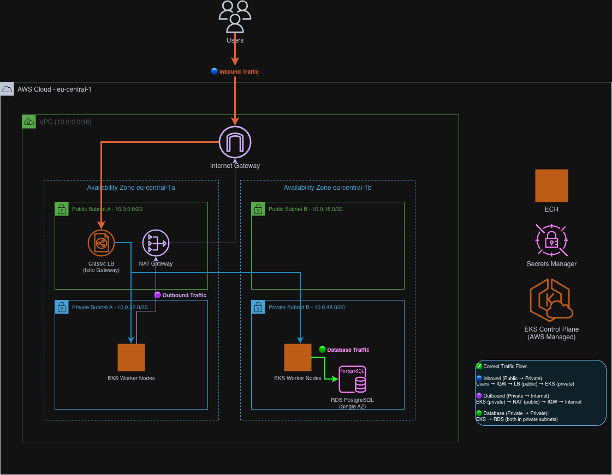
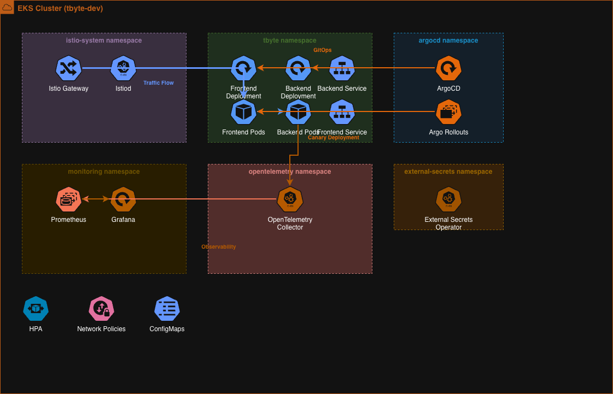
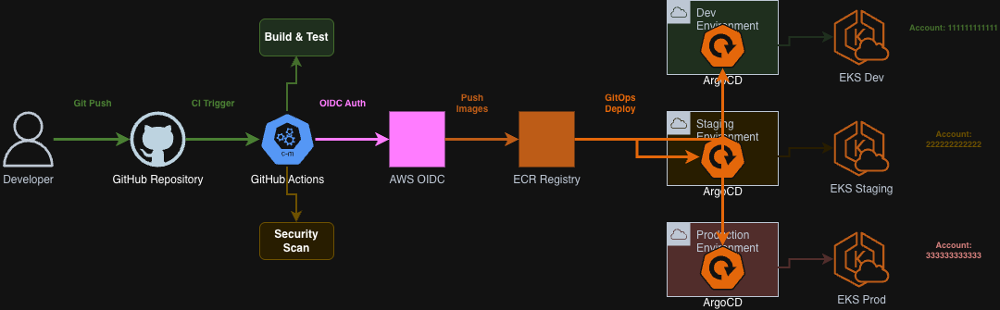

# TByte - Technical Documentation
## Senior DevOps Engineer Assessment

### Executive Summary

This document provides comprehensive technical documentation for the TByte microservices platform, following the **Problem → Approach → Solution → Result** methodology. The implementation demonstrates production-ready DevOps practices across Kubernetes, AWS cloud engineering, Infrastructure as Code, observability, and system design.

### Document Structure

Each section follows the required format:
- **Problem**: Challenge or requirement to address
- **Approach**: Strategy and methodology chosen
- **Solution**: Implementation details with code snippets
- **Result**: Outcomes, metrics, and validation

---

## Section A — Kubernetes (Core Skill)

### [A1 — Deploy a Microservice to Kubernetes](./sections/kubernetes/A1-microservices-deployment.md)
Production-ready Kubernetes manifests with Helm charts, including Deployments, Services, ConfigMaps, Secrets, HPA, PDB, and NetworkPolicies.

### [A2 — Debug a Broken Cluster](./sections/kubernetes/A2-troubleshooting-guide.md)
Systematic troubleshooting methodology for CrashLoopBackOff, unreachable services, 502 errors, and node issues with real-world examples.

---

## Section B — AWS (Cloud Engineering & Reliability)

### [B1 — Design a Highly Available Architecture in AWS](./sections/aws/B1-ha-architecture.md)
Multi-AZ AWS architecture with VPC, EKS, RDS, ElastiCache, ALB, and comprehensive HA/DR strategy.

### [B2 — Fix AWS Infrastructure Issues](./sections/aws/B2-infrastructure-troubleshooting.md)
Five common AWS scenarios: Internet access, S3 permissions, Lambda connectivity, ASG database issues, and CloudWatch logging.

### [B3 — Build a CI/CD Pipeline for AWS](./sections/aws/B3-cicd-pipeline.md)
GitHub Actions pipeline with Docker builds, ECR push, EKS deployment, and environment promotion (dev→stage→prod).

---

## Section C — Infrastructure as Code (Terraform)

### [C1 — Create Terraform for AWS](./sections/terraform/C1-terraform-modules.md)
Terragrunt-based Terraform modules for VPC, EKS, node groups, IAM, and RDS with validation and remote state.

### [C2 — Troubleshoot a Broken Terraform Deployment](./sections/terraform/C2-terraform-troubleshooting.md)
Common Terraform issues: cycle detection, IAM permissions, resource address changes, and state management.

---

## Section D — Observability & Monitoring

### [D1 — Build a Logging & Monitoring Strategy](./sections/observability/D1-monitoring-strategy.md)
Comprehensive observability with OpenTelemetry, Prometheus, Grafana, CloudWatch, and alerting strategy.

### [D2 — Fix Latency Issues](./sections/observability/D2-performance-troubleshooting.md)
Performance troubleshooting methodology for API latency, database load, cache issues, and error rates.

---

## Section E — System Design (DevOps Architecture)

### [E1 — Design a Zero-Downtime Deployment Strategy](./sections/system-design/E1-zero-downtime-deployment.md)
Argo Rollouts canary deployment strategy with automated analysis and traffic splitting.

### [E2 — Secure the Entire System](./sections/system-design/E2-security-implementation.md)
Multi-layer security: IAM least-privilege, RBAC, secrets management, network restrictions, and CI/CD security.

---

## Section F — Documentation & Presentation

### F1 — Professional Technical Document ✅
This document follows the required Problem → Approach → Solution → Result structure with diagrams, code snippets, troubleshooting steps, and real-world examples.

### [F2 — Presentation Deck](./presentation-outline.md)
5-8 slide presentation covering system summary, key decisions, AWS design, Kubernetes design, reliability enhancements, and recommendations.

---

## Architecture Overview

### High-Level System Architecture

### Detailed AWS Infrastructure

This comprehensive infrastructure diagram illustrates:
- **Multi-AZ VPC Design**: Public and private subnets across eu-central-1a and eu-central-1b
- **Traffic Flow Patterns**: Inbound (Users → IGW → LB → EKS), Outbound (EKS → NAT → IGW), Database (EKS → RDS)
- **Security Boundaries**: Internet Gateway, NAT Gateway, Load Balancer, and private subnet isolation
- **EKS Integration**: Worker nodes in private subnets with managed control plane
- **Supporting Services**: ECR, Secrets Manager, and RDS PostgreSQL

### Kubernetes Architecture

### CI/CD Pipeline Flow

## Technology Stack

| Component | Technology | Purpose |
|-----------|------------|---------|
| **Infrastructure** | Terragrunt + Terraform | Infrastructure as Code |
| **Orchestration** | AWS EKS | Managed Kubernetes |
| **GitOps** | ArgoCD | Continuous Deployment |
| **Monitoring** | Prometheus + Grafana | Metrics & Dashboards |
| **Tracing** | OpenTelemetry + Jaeger | Distributed Tracing |
| **Deployments** | Argo Rollouts | Canary Deployments |
| **CI/CD** | GitHub Actions | Build & Test Pipeline |

## Assessment Completion Status

| Section | Task | Documentation |
|---------|------|---------------|
| **A** | A1 - Microservices Deployment | [Link](./sections/kubernetes/A1-microservices-deployment.md) |
| **A** | A2 - Troubleshooting Guide  | [Link](./sections/kubernetes/A2-troubleshooting-guide.md) |
| **B** | B1 - HA Architecture  | [Link](./sections/aws/B1-ha-architecture.md) |
| **B** | B2 - Infrastructure Troubleshooting | [Link](./sections/aws/B2-infrastructure-troubleshooting.md) |
| **B** | B3 - CI/CD Pipeline | [Link](./sections/aws/B3-cicd-pipeline.md) |
| **C** | C1 - Terraform Modules | [Link](./sections/terraform/C1-terraform-modules.md) |
| **C** | C2 - Terraform Troubleshooting  | [Link](./sections/terraform/C2-terraform-troubleshooting.md) |
| **D** | D1 - Monitoring Strategy  | [Link](./sections/observability/D1-monitoring-strategy.md) |
| **D** | D2 - Performance Troubleshooting | [Link](./sections/observability/D2-performance-troubleshooting.md) |
| **E** | E1 - Zero-Downtime Deployment | [Link](./sections/system-design/E1-zero-downtime-deployment.md) |
| **E** | E2 - Security Implementation | [Link](./sections/system-design/E2-security-implementation.md) |
| **F** | F1 - Technical Document | This Document |
| **F** | F2 - Presentation Deck  | [Link](./presentation.pptx) |
