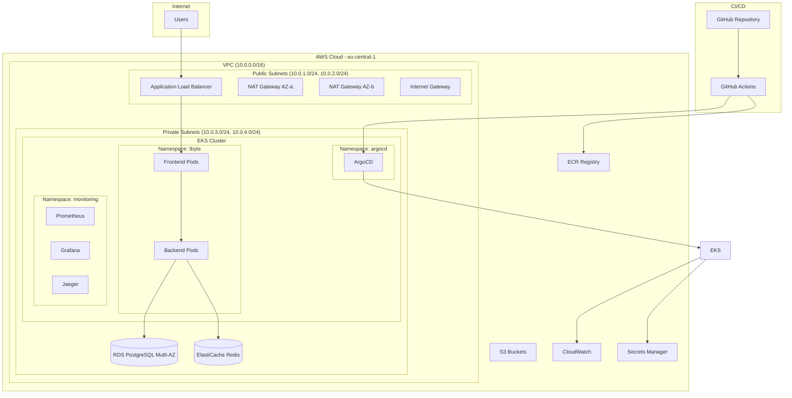

# TByte - Technical Documentation

## Executive Summary

This document provides comprehensive technical documentation for the TByte microservices platform, demonstrating production-ready DevOps practices on AWS EKS. The solution addresses all requirements from the Senior DevOps Engineer assessment, showcasing expertise in Kubernetes, AWS cloud engineering, Infrastructure as Code, observability, and system design.

## Table of Contents

1. [Architecture Overview](#architecture-overview)
2. [Section A - Kubernetes Implementation](#section-a---kubernetes-implementation)
3. [Section B - AWS Cloud Engineering](#section-b---aws-cloud-engineering)
4. [Section C - Infrastructure as Code](#section-c---infrastructure-as-code)
5. [Section D - Observability & Monitoring](#section-d---observability--monitoring)
6. [Section E - System Design](#section-e---system-design)
7. [Section F - Documentation & Presentation](#section-f---documentation--presentation)

## Architecture Overview

The TByte platform implements a modern microservices architecture on AWS EKS with the following key components:

- **Frontend**: React-based web application served via Nginx
- **Backend**: Node.js API service with business logic
- **Database**: PostgreSQL for persistent data storage
- **Cache**: Redis for session management and caching
- **Observability**: OpenTelemetry, Prometheus, Grafana, Jaeger
- **GitOps**: ArgoCD for continuous deployment
- **Security**: Multi-layer security with IAM, RBAC, Network Policies

### High-Level Architecture Diagram



## Section A - Kubernetes Implementation

### A1: Microservices Deployment

#### Problem Statement
Deploy a production-ready microservices application consisting of frontend, backend, and PostgreSQL components to Kubernetes with comprehensive configurations including security, scalability, and reliability features.

#### Approach
- **Helm Charts**: Modular, templated Kubernetes manifests for maintainability
- **Multi-tier Architecture**: Separate frontend, backend, and database tiers
- **Production Configurations**: Resource limits, health checks, scaling policies
- **Security**: Network policies, security contexts, RBAC

#### Solution Implementation

##### Helm Chart Structure
```
apps/tbyte-microservices/
├── Chart.yaml
├── values.yaml
├── templates/
│   ├── frontend/
│   │   ├── deployment.yaml
│   │   ├── service.yaml
│   │   ├── configmap.yaml
│   │   ├── hpa.yaml
│   │   ├── pdb.yaml
│   │   ├── rollout.yaml
│   │   └── analysis.yaml
│   ├── backend/
│   │   ├── deployment.yaml
│   │   ├── service.yaml
│   │   ├── configmap.yaml
│   │   ├── secret.yaml
│   │   ├── hpa.yaml
│   │   └── pdb.yaml
│   └── database/
│       ├── deployment.yaml
│       ├── service.yaml
│       ├── configmap.yaml
│       ├── secret.yaml
│       └── pvc.yaml
```

##### Key Configuration Highlights

**Resource Management:**
```yaml
resources:
  requests:
    cpu: 100m
    memory: 128Mi
  limits:
    cpu: 500m
    memory: 256Mi
```

**Health Checks:**
```yaml
livenessProbe:
  httpGet:
    path: /health
    port: http
  initialDelaySeconds: 30
  periodSeconds: 10
readinessProbe:
  httpGet:
    path: /ready
    port: http
  initialDelaySeconds: 5
  periodSeconds: 5
```

**Horizontal Pod Autoscaler:**
```yaml
spec:
  scaleTargetRef:
    apiVersion: apps/v1
    kind: Deployment
    name: tbyte-microservices-frontend
  minReplicas: 2
  maxReplicas: 10
  metrics:
  - type: Resource
    resource:
      name: cpu
      target:
        type: Utilization
        averageUtilization: 70
```

**Pod Disruption Budget:**
```yaml
spec:
  minAvailable: 1
  selector:
    matchLabels:
      app.kubernetes.io/name: tbyte-microservices
      app.kubernetes.io/component: frontend
```

#### Results
- ✅ Production-ready Kubernetes manifests deployed
- ✅ All components running with proper resource allocation
- ✅ Health checks ensuring application reliability
- ✅ Auto-scaling configured for traffic variations
- ✅ Pod disruption budgets preventing service interruption

### A2: Kubernetes Troubleshooting Guide

#### Problem Statement
Debug common Kubernetes issues: Pods stuck in CrashLoopBackOff, Service not reachable, Ingress returns 502, and node in NotReady state due to DiskPressure.

#### Troubleshooting Methodology

##### 1. Pods in CrashLoopBackOff

**Diagnostic Steps:**
```bash
# Check pod status and events
kubectl get pods -n <namespace>
kubectl describe pod <pod-name> -n <namespace>

# Check pod logs (current and previous)
kubectl logs <pod-name> -n <namespace>
kubectl logs <pod-name> -n <namespace> --previous

# Check resource constraints
kubectl top pods -n <namespace>
kubectl describe node <node-name>
```

**Common Root Causes & Fixes:**
- **Application Error**: Fix application code, update image
- **Resource Limits**: Increase memory/CPU limits in deployment
- **Missing Dependencies**: Ensure ConfigMaps/Secrets exist
- **Health Check Failure**: Adjust probe timing or endpoints

**Real Example from TByte Implementation:**
During deployment, we encountered rollout analysis failures due to:
```bash
# Issue: Analysis template argument resolution errors
kubectl describe analysisrun <run-name> -n tbyte
# Error: failed to resolve args

# Root Cause: Dynamic argument resolution in analysis template
# Fix: Hardcode pod selectors instead of using args
```

##### 2. Service Not Reachable

**Diagnostic Steps:**
```bash
# Check service configuration
kubectl get svc -n <namespace>
kubectl describe svc <service-name> -n <namespace>

# Verify endpoints
kubectl get endpoints <service-name> -n <namespace>

# Test connectivity
kubectl run debug --image=busybox -it --rm -- /bin/sh
# Inside pod: wget -qO- http://<service-name>.<namespace>:8080
```

**Common Root Causes & Fixes:**
- **Label Mismatch**: Ensure service selector matches pod labels
- **Port Configuration**: Verify targetPort matches container port
- **Network Policies**: Check if policies block traffic
- **DNS Issues**: Verify CoreDNS is functioning

##### 3. Ingress Returns 502

**Diagnostic Steps:**
```bash
# Check ingress configuration
kubectl get ingress -n <namespace>
kubectl describe ingress <ingress-name> -n <namespace>

# Check ingress controller logs
kubectl logs -n ingress-nginx deployment/ingress-nginx-controller

# Verify backend service health
kubectl get svc,endpoints -n <namespace>
```

**Common Root Causes & Fixes:**
- **Backend Unavailable**: Ensure pods are ready and healthy
- **Service Misconfiguration**: Verify service ports and selectors
- **Ingress Controller Issues**: Restart ingress controller
- **SSL/TLS Problems**: Check certificate configuration

##### 4. Node in NotReady (DiskPressure)

**Diagnostic Steps:**
```bash
# Check node status
kubectl get nodes
kubectl describe node <node-name>

# Check disk usage on node
kubectl debug node/<node-name> -it --image=busybox
# Inside debug pod: df -h

# Check system pods
kubectl get pods -n kube-system --field-selector spec.nodeName=<node-name>
```

**Common Root Causes & Fixes:**
- **Log Accumulation**: Configure log rotation, clean old logs
- **Image Cache**: Run `docker system prune` or configure garbage collection
- **Persistent Volumes**: Clean up unused PVs
- **System Files**: Clean temporary files and caches

**Permanent Fixes:**
```yaml
# Configure kubelet garbage collection
apiVersion: v1
kind: ConfigMap
metadata:
  name: kubelet-config
data:
  config.yaml: |
    imageGCHighThresholdPercent: 85
    imageGCLowThresholdPercent: 80
    evictionHard:
      nodefs.available: "10%"
      imagefs.available: "15%"
```

#### Real-World Troubleshooting Experience

During the TByte implementation, we encountered and resolved several issues:

1. **Rollout Analysis Failures**: Fixed argument resolution in analysis templates
2. **Prometheus Connectivity**: Corrected service DNS names in analysis configuration
3. **Analysis Threshold Issues**: Adjusted thresholds for realistic canary deployments

**Example Fix Applied:**
```yaml
# Before: Dynamic argument resolution (failed)
args:
- name: service-name
  value: "{{args.service-name}}"

# After: Hardcoded selectors (working)
query: |
  sum(kube_pod_status_ready{condition="true",namespace="tbyte",pod=~"tbyte-microservices-frontend-.*"})
```
